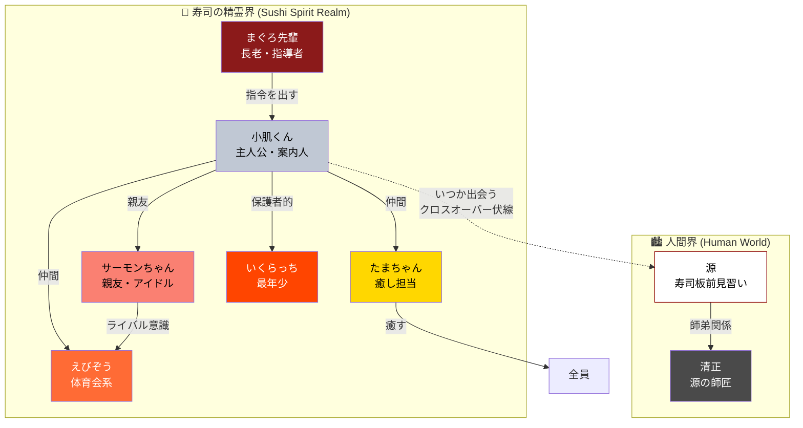

# SUSHIHEY コンテンツ＆IP世界観設計書

**作成日**: 2026年3月30日
**担当**: エージェント3（コンテンツ＆IP世界観設計）
**バージョン**: 1.0
**保存先（VPS）**: `/root/sushihey/docs/content-ip-design.md`

---

## 目次

1. [Phase 1: IP成功事例の調査・分析と転用戦略](#phase-1)
2. [Phase 2: キャラクター詳細設計](#phase-2)
3. [Phase 3: ストーリー設計](#phase-3)
4. [Phase 4: コンテンツカレンダー（3ヶ月分）](#phase-4)
5. [Phase 5: ブランドガイドライン](#phase-5)

---

<a id="phase-1"></a>
## Phase 1: IP成功事例の調査・分析とSUSHIHEYへの転用戦略

### 1.1 調査対象7事例のサマリー

| 事例 | 規模 | 成長期間 | 初期投資 | SUSHIHEY転用度 |
|------|------|---------|---------|--------------|
| **ちいかわ** | 推定年商400億円 | 4-5年 | 0円（Twitter漫画） | ★★★★★ |
| **Neuro-sama** | 年間$2.3-2.5M | 3年 | 個人開発 | ★★★☆☆ |
| **ポケモン** | 累計$1,500億+ | 30年 | ゲーム開発費 | ★★★★☆（構造参考） |
| **Kurzgesagt** | 年間数百万ドル | 13年 | 個人プロジェクト | ★★★★★ |
| **サンリオ** | 年商1,698億円 | 50年+ | 企業投資 | ★★★★☆（構造参考） |
| **Lil Miquela** | 年間$2-10M | 5年 | AI生成 | ★★★☆☆ |
| **寿司系YouTube** | 月$5K-$583K | 2-10年 | 0-低コスト | ★★★★★ |

---

### 1.2 ちいかわ — SNS漫画→400億円IPの黄金パターン

#### 成長タイムライン
| 時期 | イベント | 指標 |
|------|---------|------|
| 2020年1月 | ナガノがTwitterで「ちいかわ」連載開始 | フォロワー数万人 |
| 2020年後半 | じわじわと認知拡大、二次創作増加 | — |
| 2021年 | グッズ展開開始、コラボ増加 | フォロワー100万人超 |
| 2022年4月 | TVアニメ放送開始（フジテレビ「めざましテレビ」内） | 爆発的認知拡大 |
| 2023年 | グローバル展開加速、中国・東南アジアでも人気 | 推定年商200億円 |
| 2024-2025年 | IPライセンス拡大、ポップアップストア世界展開 | 推定年商400億円規模 |

#### 成功の構造的要因
1. **「かわいい×切ない」の感情二重構造**: ちいかわの世界は一見かわいいが、敵に襲われたり辛い状況がある。この「ギャップ」が大人の共感を呼ぶ
2. **毎日更新の習慣形成**: ナガノは毎日〜隔日で4コマを投稿。読者の生活リズムに組み込まれる
3. **謎と伏線によるストーリーへの没入**: 「でかつよ」「キメラ化」などの謎が読者の考察を誘発し、二次創作と議論を活性化
4. **キャラクターの「余白」**: シンプルなデザインが感情投影を容易にする（サンリオのキティと同じ原理）
5. **メディアミックスの段階的展開**: Twitter→グッズ→アニメ→ゲーム→グローバルの順序が正しい

#### SUSHIHEYへの転用ポイント
- **小肌くんの世界線Bは「ちいかわモデル」を直接適用可能**
- 毎日〜隔日のSNS短編漫画/アニメを投稿し、習慣形成を狙う
- 「かわいい寿司の妖精」×「実は厳しい修行の世界」のギャップ構造を導入
- キャラクターデザインはシンプルに（グッズ化しやすく、感情投影しやすく）

---

### 1.3 Neuro-sama — AI VTuberの収益化モデル

#### 核心データ
- **年間収益**: $2.3-2.5M（約3.4-3.7億円）
- **Twitch全体でサブ数1位**（2026年1月: アクティブサブ162,459人）
- **課金コンバージョン率**: 1.59%（人間VTuber: 0.83-1.18%）
- **収入安定性（ジニ係数）**: 0.24（人間VTuber: 0.35-0.41）→ AIの方が安定

#### 成功の構造的要因
1. **予測不可能性がエンターテイメント価値を生む**: AIが「人間が言わないこと」を言うカオスが差別化
2. **透明なパラソーシャル関係**: ファンはAIと知りながら感情的な絆を形成
3. **開発者の匿名性戦略**: Vedalは裏方に徹し、キャラの自律性を演出
4. **SuperChatが「参加権」として機能**: 鑑賞対価ではなく、AIの行動に影響を与える手段

#### SUSHIHEYへの転用ポイント
- **小肌くんをAIキャラクターとして配信に出す可能性**（中長期）
- 視聴者との双方向インタラクション（「今日の寿司ネタ占い」等）
- ただし初期フェーズでは技術的ハードルが高いため、Phase 2以降の検討事項

---

### 1.4 Kurzgesagt — 教育アニメ×品質主義の最高到達点

#### 核心データ
- **登録者**: 約2,485万人（2025年11月）
- **総再生**: 約40.6億回
- **チーム**: 60人以上の正社員
- **1本の制作時間**: 1,200時間以上（10分動画1本）
- **収益構造**: グッズ40%、YouTube広告13%、Patreon 9%、スポンサー22%

#### SUSHIHEYへの転用ポイント
- **「寿司版Kurzgesagt」が世界線Bのコンテンツの方向性**
- 寿司の科学（なぜ酢飯は旨いのか？）、歴史（寿司の1,000年の進化）をアニメで解説
- **品質>量**: 月1-2本の高品質アニメ（5分）を目標。1,200時間は無理だが、AI活用で100時間/本を目指す
- **ビジュアルメタファー**: 抽象的な概念を寿司キャラで表現（例：「鮮度」を妖精の元気度で表現）
- **多言語展開**: 初期から英語+日本語の2言語。字幕のクラウドソーシングで他言語に拡張

---

### 1.5 ポケモン — キャラDB×メディアミックスの究極モデル

#### 核心データ
- **累計生涯収益**: $1,500億以上（史上最高収益メディアフランチャイズ）
- **キャラクター数**: 1,028種+変種
- **収益内訳**: マーチャンダイジング61%、ゲーム20%、カード10%

#### SUSHIHEYへの転用ポイント
- **「寿司ネタ図鑑」= ポケモン図鑑の構造を転用**
- 200種の寿司ネタ妖精を段階的に追加（最初の30種→100種→200種）
- 各キャラにタイプ・属性・レア度を設定（収集欲求の刺激）
- **「寿司ネタの妖精を集める」行為自体がコンテンツ**になる

---

### 1.6 サンリオ — 50年間稼ぎ続けるキャラビジネスの秘密

#### 核心データ
- **FY2025売上**: 1,698億円（過去最高）
- **キティの累計帝国**: 約$800億
- **キャラクター数**: 450以上
- **「口のないデザイン」**: 見る人が自分の感情を投影できる

#### SUSHIHEYへの転用ポイント
- **小肌くんのデザインに「余白」を残す**（表情を最小限にし、感情投影を促す）
- ライセンスモデルを長期ビジョンに組み込む（5年後の目標）
- **キャラクターポートフォリオの多角化**: 小肌くん1体に依存せず、5-10体のサブキャラを同時育成
- パートナーへの高い裁量権（コラボの自由度を高める）

---

### 1.7 寿司コンテンツの海外市場データ

#### プラットフォーム別のポテンシャル

| プラットフォーム | 寿司コンテンツの規模 | SUSHIHEYの機会 |
|---------------|-------------------|--------------|
| **YouTube** | トップ層: 3,000万人超（ASMR/ムクバン）、専門教育: 200万人規模 | 「教育×キャラ」の空白地帯 |
| **TikTok** | #sushi: 278億回視聴、140万投稿 | #eatingasmr との組合せで平均11.6万回/投稿 |
| **Reddit** | r/sushi: 452,440人 | 自作寿司投稿が中心。教育コンテンツの需要あり |
| **Pinterest** | 月間5.37億ユーザー、Pinの平均寿命3.88ヶ月 | 寿司のビジュアル特性と極めて高い相性 |

#### 未開拓の黄金ニッチ
**「AI寿司キャラクター × 教育コンテンツ × ASMR要素」の組み合わせは、現時点で明確な競合が存在しない**

---

### 1.8 YouTube AI動画ポリシーへの対応戦略

#### 2025年7月改定の核心ルール
- ポリシー名: 「非本格的コンテンツ（inauthentic content）」
- **OK**: AIをツールとして使い、人間が創造的方向性を主導。オリジナルストーリー・キャラあり
- **NG**: テンプレ量産、AI音声のみでスライドショー、同一フォーマットの大量アップ

#### SUSHIHEYの対応設計

```
【収益化が認められるための5条件】
1. オリジナルキャラクター（小肌くん等）が主人公
2. 独自ストーリーライン（世界線A/B）
3. 人間による台本編集・演出指示
4. 各エピソードが異なる展開・テーマ
5. 教育的価値の付加（寿司の知識・文化）
```

#### ツール選定（2026年3月時点の最適解）

| 用途 | 推奨ツール | 理由 |
|------|----------|------|
| **AI動画生成（メイン）** | **Google Veo 3.1** | 最高品質、ネイティブ音声生成、$7.99/月〜 |
| **AI動画生成（サブ）** | **Runway Gen-4.5** | Proプラン$28/月、権利を主張しない |
| **マルチショット** | **Vidu Q3** | 16秒マルチショット、セリフ同期、$7.99/月 |
| **画像生成** | **FixArt.ai** | 無料、ウォーターマークなし、商用利用可 |
| **台本** | **Claude/ChatGPT** | 人間が必ず編集する前提 |
| **音声** | **ElevenLabs** | 高品質TTS、キャラ音声のカスタマイズ |

> **重要**: Kling AIは品質が高いが、**生成物のライセンスをKuaishouに付与する規約**があるため、IPビルディングには不適。Soraは2026年3月24日にサービス終了済み。

---

<a id="phase-2"></a>
## Phase 2: キャラクター詳細設計

### 設計原則（全調査から導出）

```
1. シンプルさ: キティの「口がない」、ちいかわの「丸い体」→ 感情投影の余白
2. 収集性: ポケモンの図鑑構造 → 寿司ネタ妖精を「集めたくなる」デザイン
3. ギャップ: ちいかわの「かわいい×切ない」→ 小肌くんの「かわいい×寿司職人の厳しさ」
4. 一貫性: Kurzgesagtの鳥キャラ → AI生成プロンプトで再現可能な明確な特徴
5. グッズ化: サンリオの製品5万点 → 立体化・プリント映えするフォルム
```

---

### 2.1 小肌くん（Kohada-kun）— メインキャラクター

#### 基本プロフィール
| 項目 | 詳細 |
|------|------|
| **種族** | 寿司ネタの妖精（小肌＝コノシロの幼魚の寿司） |
| **体長** | にぎり寿司1貫分（約8cm）の等身大。人間世界では手のひらサイズ |
| **年齢** | 不明（妖精なので年齢の概念がない。子供のような振る舞い） |
| **一人称** | 「ぼく」（英語では "I" だが、字幕で "(kohada)" と注記） |
| **口調** | 丁寧だが時々方言が出る。「〜だよ」「〜なんだ」。英語では素朴で warm な話し方 |
| **決めゼリフ** | 「いただきます、は "ありがとう" なんだよ」(英: "Itadakimasu means 'thank you' for life.") |
| **性格を一言で** | 「好奇心旺盛な寿司の案内人」 |

#### ビジュアル詳細

```
【体型】
- 頭身: 1.5頭身（頭が体の2/3）
- 体型: ふっくらした楕円形。にぎり寿司のシャリを模した下半身
- 上半分: 銀色に光る小肌の皮を模した「帽子」状の頭部

【カラー】
- メインボディ（シャリ部分）: #FFF5E6（温かみのあるクリーム白）
- 頭部（小肌の皮）: #C0C8D4（銀青色）+ #7B8FA3（銀灰色のグラデーション）
- 頬のチーク: #FFB5B5（桜ピンク）
- 目: #2D2D2D（黒）、丸い点目（ちいかわ式）
- 口: 小さな「ω」形。基本は閉じている（感情投影の余白）

【特徴的パーツ】
- 頭の「小肌の切り込み」: 本物の小肌寿司にある飾り包丁の模様が、髪の毛のように3本ある
- 小さな手: 丸い手（指は描かない。ちいかわ式）
- 背中に小さなしょうゆ瓶を背負っている（リュックのように）

【表情パターン】（6種）
1. 通常: 点目 + ω口
2. 嬉しい: 点目（弧） + 開いたω口
3. 驚き: ○目 + 開いた口
4. 悲しい: 点目（下がり） + へ口
5. 怒り: つり目 + への字口（めったに使わない）
6. キラキラ: ★目 + 大きな笑顔（寿司の知識を語るとき）
```

#### 背景ストーリー
小肌くんは「寿司の精霊界（Sushi Spirit Realm）」から来た妖精。寿司の精霊界は、人間が「いただきます」と心から感謝して食べるたびに、少しずつエネルギーが生まれる世界。近年、ファストフード化が進み、感謝なく寿司を食べる人が増えたことで、精霊界のエネルギーが弱まっている。小肌くんは精霊界の「長老まぐろ」に命じられ、人間界に派遣された。使命は「寿司の素晴らしさと、食への感謝を世界に広めること」。

#### AI画像生成プロンプト（英語・650文字）

```
A cute chibi mascot character called "Kohada-kun", a sushi spirit fairy inspired by
kohada (gizzard shad) nigiri sushi. Character design style: Japanese kawaii, similar to
Chiikawa or Sumikko Gurashi — simple, round, minimal details, maximum expressiveness.

Body: 1.5 head-to-body ratio. Plump oval shape resembling a piece of nigiri sushi.
The lower body (shari/rice portion) is warm cream white (#FFF5E6) with subtle rice
texture. The upper head portion resembles the silvery-blue kohada fish skin (#C0C8D4
to #7B8FA3 gradient), worn like a natural cap or hood over the head.

Face: Two small round dot eyes (#2D2D2D), positioned in the upper third of the face.
A tiny omega (ω) shaped mouth, usually closed. Soft pink circular blush marks on both
cheeks (#FFB5B5). The expression is gentle, curious, and warm.

Distinctive features: Three decorative knife-cut lines on the kohada skin cap (resembling
the traditional kazari-bocho cuts on real kohada sushi), looking like stylized hair strands.
Small round hands without visible fingers. A tiny soy sauce bottle carried on the back
like a backpack, with a small strap visible over one shoulder.

Art style: Flat colors, minimal shading, thick clean outlines, vector-art quality.
White or transparent background. Front-facing 3/4 view. No realistic textures —
everything is simplified and iconic. Suitable for animation, merchandise, and sticker
production. The character should look friendly, approachable, and instantly recognizable
at any size from favicon to poster.
```

---

### 2.2 源（Gen）— 世界線Aの主人公

#### 基本プロフィール
| 項目 | 詳細 |
|------|------|
| **本名** | 河村 源（かわむら げん） |
| **年齢** | 23歳 |
| **出身** | 千葉県銚子市（漁師町） |
| **現在地** | 東京・銀座の寿司店「鮨 清正（すし きよまさ）」で修行中 |
| **修行年数** | 2年目（飯炊き3年、握り8年の世界で、まだ飯炊きすら任せてもらえない） |
| **一人称** | 「俺」（英語では "I"、字幕ではニュアンスを補足） |
| **口調** | ぶっきらぼうだが素直。「〜っすね」「〜なんすよ」 |
| **決めゼリフ** | 「いい寿司は、魚じゃなくて、人が握るんだ」(英: "Great sushi isn't made by fish — it's made by people.") |
| **性格を一言で** | 「不器用だが諦めない求道者」 |

#### ビジュアル詳細

```
【体型】
- 身長: 173cm、やや痩せ型だが腕は太い（包丁を毎日握っているため）
- 姿勢: 少し前傾（カウンターに立つ姿勢が染みついている）

【カラー】
- 肌: #F5D6B8（日焼けした小麦色）
- 髪: #1A1A2E（漆黒。短髪、やや無造作）
- 白衣: #FFFFFF（純白の板前着）
- 鉢巻き: #8B0000（深紅。師匠から譲り受けたもの）
- 目: #3D2B1F（焦げ茶。真剣な眼差し）

【特徴的パーツ】
- 左手の人差し指に小さな傷跡（修行初日に包丁で切った）
- 師匠から譲り受けた深紅の鉢巻き（物語の重要アイテム）
- 腰に差した柳刃包丁の鞘
- 白衣の袖をいつも肘までまくっている

【表情パターン】
1. 集中: 眉間にしわ、口を結ぶ（魚を捌くとき）
2. 悔しさ: 唇を噛む、目を伏せる
3. 感動: 目が見開き、少し涙目
4. 笑顔: 照れくさそうな片方の口角だけ上がる笑み
5. 怒り: 歯を食いしばる（自分への怒り。他人には怒らない）
```

#### 背景ストーリー
銚子の漁師の家に生まれた源は、祖父の船で魚を獲って育った。高校卒業後、地元のスーパーで鮮魚部門に就職したが、銀座で食べた1貫の寿司に衝撃を受け、23歳で脱サラ。師匠「清正（きよまさ）」の元に弟子入りする。清正は昭和の頑固親父で、言葉より背中で教えるタイプ。源は不器用で失敗ばかりだが、魚への理解力だけは師匠も認めている。

#### AI画像生成プロンプト（英語・550文字）

```
A young Japanese sushi apprentice named "Gen", age 23, in a realistic anime art style
similar to Jujutsu Kaisen or Vinland Saga — semi-realistic proportions with expressive
features. NOT chibi or super-deformed.

Physical: 173cm tall, lean but with strong forearms from years of knife work. Slightly
tanned skin (#F5D6B8) suggesting outdoor upbringing. Jet-black short hair (#1A1A2E),
slightly messy and natural. Deep brown eyes (#3D2B1F) with an intense, focused gaze.
A small scar on his left index finger.

Clothing: Traditional white sushi chef uniform (clean, crisp white #FFFFFF). Sleeves
rolled up to the elbows, revealing his forearms. A deep crimson headband (#8B0000) tied
around his forehead — this is his most distinctive accessory, inherited from his master.
A yanagiba (sushi knife) sheath tucked at his waist.

Expression: Default expression is serious concentration — slight furrow between the
brows, lips pressed together, eyes focused on his work. Occasionally shows a shy,
lopsided smile where only the right corner of his mouth rises.

Setting context: Standing behind a traditional hinoki (cypress wood) sushi counter in
a high-end Ginza sushi restaurant. Warm lighting. Clean, minimal background.

Art style: Semi-realistic anime illustration, suitable for both still images and
animation. Clean linework, detailed clothing folds, atmospheric lighting. The character
should convey dedication, youth, and quiet determination.
```

---

### 2.3 サブキャラクター5体（寿司ネタの妖精）

全キャラ共通ルール:
- 体型は小肌くんと同じ1.5頭身
- 目は丸い点目（色違いで個性を出す）
- 各キャラの「ネタ部分」が帽子/頭部になるデザイン
- 全員が「寿司の精霊界」出身

---

#### 2.3.1 まぐろ先輩（Maguro-senpai）

| 項目 | 詳細 |
|------|------|
| **種族** | 本マグロ（Bluefin Tuna）の妖精 |
| **ポジション** | 精霊界の長老。小肌くんの上司 |
| **性格** | 威厳があるが面倒見がいい。口数は少ないが、言葉に重みがある |
| **一言性格** | 「寡黙な大物」 |
| **口調** | 「〜であろう」「〜じゃ」（英語: 格式高い old English 風） |
| **決めゼリフ** | 「焦るな。旨い寿司は、待てる人間の前に現れる」 |

```
【カラー】
- メインボディ（シャリ部分）: #FFF5E6（クリーム白）
- 頭部（赤身）: #8B1A1A（深い赤）→ #C41E3A（鮮やかな赤）グラデーション
- 頬チーク: #FF8080（淡い赤）
- 目: #2D2D2D（黒）、やや細め（威厳）
- 体型: 小肌くんより一回り大きい（1.2倍）

【特徴】
- 頭部の赤身模様にマグロ特有の「サシ（脂の筋）」が2-3本
- 小さな白い眉毛がある（長老感）
- 背中にわさびの葉を一枚、マントのように羽織っている
```

**AI画像生成プロンプト:**
```
A dignified chibi sushi spirit character called "Maguro-senpai" (Tuna Elder). Same
kawaii art style as Kohada-kun — 1.5 head-to-body ratio, round, simple, Chiikawa-style.
Slightly larger than other sushi spirits (1.2x scale). The head/cap portion is deep
red tuna sashimi (#8B1A1A to #C41E3A gradient) with 2-3 subtle white marbling lines
(fatty tuna streaks). Small white eyebrow tufts above slightly narrowed dot eyes,
giving a wise elder appearance. Light red blush (#FF8080). Cream white body (#FFF5E6).
A single wasabi leaf draped over the back like a small cape. Round hands without fingers.
Flat colors, clean outlines, vector-art quality, white background.
```

---

#### 2.3.2 サーモンちゃん（Salmon-chan）

| 項目 | 詳細 |
|------|------|
| **種族** | サーモン（Salmon）の妖精 |
| **ポジション** | 小肌くんの親友。一番人気（実際にサーモンは寿司ネタ人気No.1） |
| **性格** | 明るく社交的。SNS大好き。ミーハーだが愛すべきキャラ |
| **一言性格** | 「みんなのアイドル」 |
| **口調** | 「〜でしょ！」「やばーい！」（英語: Valley girl 風） |
| **決めゼリフ** | 「新しいこと、やってみなきゃ分かんないでしょ！」 |

```
【カラー】
- メインボディ: #FFF5E6（クリーム白）
- 頭部（サーモン）: #FA8072（サーモンピンク）→ #FF6347（鮮やかなオレンジピンク）
- 頬チーク: #FFB6C1（ライトピンク）
- 目: #2D2D2D（黒）、キラキラした丸目（やや大きめ）
- 髪飾り: レモンの輪切り型ヘアピン（#FFE135）

【特徴】
- サーモンの脂の白い縞模様が頭部に斜めに走る
- レモンの輪切り型ヘアピンをつけている（サーモンにレモンを添える文化の象徴）
- 常に笑顔。目がキラキラ
- スマホ（ガリの形）を常に持っている
```

**AI画像生成プロンプト:**
```
A cheerful chibi sushi spirit character called "Salmon-chan". Kawaii art style,
Chiikawa/Sumikko Gurashi inspired — 1.5 head-to-body ratio. Head portion is salmon
pink (#FA8072 to #FF6347 gradient) with diagonal white fat-marbling stripes. Large,
sparkling round dot eyes with tiny star highlights. Always smiling with a wide open
mouth. Light pink blush (#FFB6C1) on both cheeks. Cream white body (#FFF5E6).
Distinctive accessory: a small lemon-slice hair clip (#FFE135) on the right side of
the head. Holds a tiny gari (pickled ginger)-shaped smartphone. Round hands without
fingers. Flat colors, clean outlines, vector-art, white background. The character
radiates energy, friendliness, and social butterfly vibes.
```

---

#### 2.3.3 えびぞう（Ebizo）

| 項目 | 詳細 |
|------|------|
| **種族** | 海老（Shrimp）の妖精 |
| **ポジション** | チームの体育会系。行動派 |
| **性格** | 熱血。まっすぐ。少しおバカだが憎めない |
| **一言性格** | 「突っ走る元気印」 |
| **口調** | 「〜だぜ！」「やるぞー！」（英語: enthusiastic bro） |
| **決めゼリフ** | 「曲がってたっていい。エビだって曲がってるけど、前に進んでる！」 |

```
【カラー】
- メインボディ: #FFF5E6（クリーム白）
- 頭部（海老）: #FF6B35（鮮やかなオレンジ赤）
- 尻尾: 頭から後ろに伸びるエビの尻尾パーツ（#FF6B35 + #FF8C42 のストライプ）
- 頬チーク: #FFAA80（オレンジピンク）
- 目: #2D2D2D（黒）、太い眉毛つき

【特徴】
- エビの尻尾が頭の後ろから伸びている（ポニーテールのように）
- 太い眉毛（熱血キャラの象徴）
- 体の表面にエビの殻の節模様（3段くらい）
- いつも腕まくりのポーズ（丸い手だけど）
```

**AI画像生成プロンプト:**
```
An energetic chibi sushi spirit character called "Ebizo" (Shrimp). Kawaii art style,
1.5 head-to-body ratio. Head portion is vivid orange-red (#FF6B35) resembling a cooked
shrimp. A decorative shrimp tail extends from the back of the head like a ponytail,
with orange-striped segments (#FF6B35 and #FF8C42 alternating). Thick bold eyebrows
above round dot eyes (#2D2D2D), giving an energetic hot-blooded expression. Wide grin
showing determination. Orange-pink blush (#FFAA80). Cream white body (#FFF5E6) with
3 subtle horizontal shell-segment lines on the torso. Round hands without fingers,
one arm raised in a fist-pump pose. Flat colors, clean outlines, vector-art, white
background. The character exudes enthusiasm, courage, and lovable foolishness.
```

---

#### 2.3.4 たまちゃん（Tama-chan）

| 項目 | 詳細 |
|------|------|
| **種族** | 玉子焼き（Egg / Tamago）の妖精 |
| **ポジション** | チームの癒し担当。ムードメーカー |
| **性格** | おっとり、温かい、誰にでも優しい。少し天然ボケ |
| **一言性格** | 「ほっこり癒しの太陽」 |
| **口調** | 「〜だよぉ」「えへへ」（英語: soft, gentle） |
| **決めゼリフ** | 「みんな違って、みんな美味しい」(英: "Everyone's different, and everyone's delicious.") |

```
【カラー】
- メインボディ: #FFF5E6（クリーム白）
- 頭部（玉子）: #FFD700（ゴールデンイエロー）→ #FFF176（明るいイエロー）
- 頬チーク: #FFCC80（オレンジイエロー）
- 目: #2D2D2D（黒）、たれ目（のんびり）
- 海苔の帯: #1A1A1A（黒）— 体の真ん中を横に走る帯

【特徴】
- 本物の玉子寿司のように、体の中央に海苔の帯が巻かれている
- たれ目で常にほんわかした表情
- 頭頂部が少し平らで、焼き色のブラウングラデーション（#D4A017）がある
- 寝てることが多い（立ったまま寝る特技）
```

**AI画像生成プロンプト:**
```
A gentle, sleepy chibi sushi spirit character called "Tama-chan" (Egg). Kawaii art
style, 1.5 head-to-body ratio. Head portion is golden yellow (#FFD700 to #FFF176
gradient) resembling a piece of tamagoyaki (Japanese egg omelet), with a slightly
flat top that has subtle brown grill marks (#D4A017). Droopy, relaxed dot eyes
(#2D2D2D) that look perpetually sleepy and content. Small gentle smile. Orange-yellow
blush (#FFCC80). Cream white body (#FFF5E6). A distinctive black nori (seaweed) belt
(#1A1A1A) wraps horizontally around the middle of the body, just like real tamago
nigiri sushi. Round hands without fingers. Flat colors, clean outlines, vector-art,
white background. The character radiates warmth, gentleness, and comforting coziness.
```

---

#### 2.3.5 いくらっち（Ikuracchi）

| 項目 | 詳細 |
|------|------|
| **種族** | いくら（Salmon Roe）の妖精 |
| **ポジション** | 最年少。チームのマスコット的存在 |
| **性格** | 好奇心旺盛で甘えん坊。よく泣くがすぐ笑う |
| **一言性格** | 「キラキラ泣き虫ベイビー」 |
| **口調** | 「〜なの！」「わぁ！」（英語: childlike wonder） |
| **決めゼリフ** | 「キラキラしてるものは、全部好き！」 |

```
【カラー】
- メインボディ: #FFF5E6（クリーム白）
- 頭部（いくら）: #FF4500（鮮やかなオレンジ赤）、半透明感のある質感
- 頭の中の「核」: #FFD700（金色の小さな丸）— いくらの中心の脂肪球を表現
- 頬チーク: #FF7F7F（ピンク赤）
- 目: #2D2D2D（黒）、大きな丸目（子供らしさ）

【特徴】
- 頭がいくらの粒のように半透明でプルプルした印象
- 頭の中に金色の小さな球（核）が透けて見える
- 体の周りに小さないくら粒が3-4個浮遊（兄弟？仲間？）
- 泣くと目からいくら粒がポロポロ出る（涙＝いくら）
- 全キャラで最小サイズ（小肌くんの0.7倍）
```

**AI画像生成プロンプト:**
```
The smallest and youngest chibi sushi spirit character called "Ikuracchi" (Salmon Roe).
Kawaii art style, 1.5 head-to-body ratio, 0.7x the size of other sushi spirits. Head
portion is a glossy, translucent-looking sphere of vivid orange-red (#FF4500) resembling
a single salmon roe egg, with a small golden nucleus (#FFD700) visible inside like a
tiny sun. Extra-large round dot eyes (#2D2D2D) expressing childlike wonder and
innocence. Small "o" shaped mouth, often open in surprise or delight. Pink-red blush
(#FF7F7F). Cream white body (#FFF5E6). 3-4 tiny floating salmon roe spheres orbit
around the character like small companions. Round hands without fingers, often reaching
upward. Flat colors, clean outlines, vector-art, white background. The character is
the baby of the group — maximum cuteness, sparkling, precious, and tiny.
```

---

### 2.4 キャラクター関係図



---

<a id="phase-3"></a>
## Phase 3: ストーリー設計

### 3.1 世界線A（源の修行ストーリー）: 第1話〜第12話

**テーマ**: 「本物の寿司を握るとは何か？」
**ターゲット**: 大人（20〜40代）、料理好き、日本文化に興味がある人
**トーン**: リアル、感情的、時にユーモラス。『将太の寿司』×『食戟のソーマ』×ドキュメンタリー
**1話あたり**: 3〜5分のショートドラマ

---

#### 第1話「銀座の一貫」(The One Piece in Ginza)
源は銚子の鮮魚スーパーで退屈な日々を送っていた。ある日、東京出張で偶然入った銀座の寿司店「鮨 清正」で、師匠・清正の握るシマアジの一貫を食べ、涙を流す。「こんな世界があったのか」。翌日、辞表を出し、清正に弟子入りを志願する。清正は「帰れ」と一蹴。源は店の前で3日間座り込み、ようやく「掃除だけならいい」と許される。

#### 第2話「シャリの温度」(The Temperature of Shari)
修行2週目。源はカウンターに立つどころか、シャリ（酢飯）にすら触らせてもらえない。仕事は掃除、皿洗い、買い出し。ある夜、先輩が炊いたシャリの残りを食べ、温度の違いに気づく。「なぜ同じ米なのに、師匠のシャリだけ人肌なんだ？」。師匠の背中を観察し始める。

#### 第3話「包丁の声」(The Voice of the Knife)
源が初めて包丁を握る日。師匠は大根のかつら剥きを命じる。何十本も失敗する源。左手の人差し指を切る（この傷が源のトレードマーク）。師匠は一言だけ言う：「包丁は引くもんだ。押すな」。夜、一人で練習する源の横に、師匠が黙って砥石を置いていく。

#### 第4話「豊洲の朝」(Dawn at Toyosu)
朝4時、師匠に連れられて豊洲市場へ。マグロの競りを目の当たりにする源。仲買人の目利き、魚の鮮度の見極め方を学ぶ。師匠が仲買人と交わす暗黙の駆け引きに圧倒される。帰りのタクシーで師匠が初めて笑い、「お前、魚を見る目だけは悪くない」と言う。

#### 第5話「先輩の壁」(The Senior's Wall)
店の先輩・高橋（修行7年目）が源に辛く当たり始める。嫉妬ではなく「甘い覚悟で入ってくるな」という警告。高橋は家族を犠牲にして修行を続けている。源は高橋の握る玉子焼きの美しさに感動し、「7年かけてこれを磨いたんすね」と言う。高橋は無言で頷く。

#### 第6話「季節を握る」(Gripping the Season)
春。師匠が「今日から魚に触れ」と言う。初めての仕込み。鯛の鱗引き、アジの三枚おろし。師匠は「寿司屋は季節を売る商売だ」と教える。桜鯛の美しさに心を奪われる源。「この魚を食べた人が、春を感じてくれたら」と初めて「食べる人」のことを考える。

#### 第7話「失敗の味」(The Taste of Failure)
源が初めてシャリを炊くことを許される。しかし水加減を間違え、一日分のシャリを台無しにする。師匠は静かに怒り、「明日から掃除に戻れ」と言う。源は営業後の店で一人、失敗したシャリを食べ続ける。翌朝、師匠のもとに行き、「もう一度やらせてください」と頭を下げる。

#### 第8話「常連の一言」(A Regular's Words)
常連客の老紳士（元外交官）が「最近この店の掃除が行き届いてるね」と師匠に言う。師匠は「新しいのが来たんで」とだけ答える。老紳士が源に「掃除ができる人間は、いい寿司を握る」と言い残して帰る。源はその言葉の意味を考え続ける。

#### 第9話「ネタと対話する」(Conversing with the Fish)
師匠が源に目隠しをさせ、魚を触らせる。「目で見るな。手で聞け」。鮮度、脂のノリ、身の締まり具合を指先だけで判断する訓練。源は初めて「魚が語りかけてくる」感覚を体験する。この回で寿司職人の「触覚の知性」を視聴者に教える。

#### 第10話「外国人のお客さん」(The Foreign Guest)
英語しか話せないアメリカ人カップルが来店。師匠は英語が話せない。源は拙い英語で必死に対応する。「This is kohada. Small fish, but... very beautiful taste.」通じないもどかしさと、食を通じて通じ合う喜び。**（SUSHIHEYのミッション＝「寿司の素晴らしさを世界に」のメタファー）**

#### 第11話「師匠の過去」(The Master's Past)
台風で営業休止の夜。師匠が珍しく酒を飲み、過去を語る。かつてパリの日本料理店に招かれたが、「本物の寿司は日本でしか握れない」と帰国した話。師匠の深紅の鉢巻きは、パリで亡くなった恩師の形見だった。源は自分がこの鉢巻きを継ぐ者になりたいと心に誓う。

#### 第12話「最初の一貫」(The First Piece)
修行1年の節目。師匠が「今日、お前が握れ」と言う。源は震える手で初めてのにぎり（コハダ）を握る。師匠が一口食べ、長い沈黙の後、「まだまだだな。…だが、悪くない」と言う。源の目から涙。エンディングで、カウンターの片隅に、小さな銀色の何かがキラリと光る（**小肌くんのシルエット ← クロスオーバー伏線**）。

---

### 3.2 世界線B（小肌くんの冒険）: 第1話〜第12話

**テーマ**: 「食への感謝と、寿司の素晴らしさを世界に伝える」
**ターゲット**: 全年齢（特に子供〜20代、海外視聴者）
**トーン**: ポップ、教育的、時に感動的。『ポケモン』×『Kurzgesagt』×『ちいかわ』
**1話あたり**: 1.5〜3分のショートアニメ

---

#### 第1話「いただきます」(Itadakimasu)
寿司の精霊界。エネルギーメーター（「感謝ゲージ」）が危険水域まで低下。長老まぐろ先輩が緊急会議を開く。「人間界で感謝なく寿司を食べる者が増えている。このままでは精霊界が消滅する」。小肌くんが志願して人間界へ向かう。サーモンちゃんが「私も行く！」。ポータル（回転寿司のレーン型）を通って東京に降り立つ。街の巨大さに驚く2人。**教育要素: 「いただきます」の本当の意味（命をいただくことへの感謝）を解説**

#### 第2話「回転寿司の危機」(Conveyor Belt Crisis)
小肌くんとサーモンちゃんが回転寿司店に潜入。人間たちが寿司を大量に注文して残す光景に衝撃を受ける。「こんなに残すなんて…精霊界のエネルギーが減るわけだ」。小肌くんが勇気を出して、寿司を残そうとした子供の前に現れる。子供だけに見える小肌くん。「ねぇ、このお寿司、海からずっと旅してきたんだよ」。子供が最後の一貫を食べ、精霊界のエネルギーメーターが微かに上がる。**教育要素: フードロスの問題と、寿司1貫ができるまでの旅**

#### 第3話「サーモンちゃんの秘密」(Salmon-chan's Secret)
サーモンちゃんがSNSの「人気寿司ネタランキング」を発見。サーモンが10年連続1位であることを知り大喜び。しかし「伝統的な江戸前寿司にはサーモンがなかった」という事実も知る。「え…私、本当は仲間はずれなの？」と落ち込むサーモンちゃん。小肌くんが「新しい仲間だって、素敵じゃん」と励ます。**教育要素: 江戸前寿司の歴史と、サーモンが寿司ネタになった経緯（1980年代のノルウェーの戦略）**

#### 第4話「えびぞう、突撃！」(Ebizo Charges In!)
えびぞうが精霊界から合流。到着早々、築地場外市場に突撃して迷子になる。魚屋のおじさんに捕まりそうになりながら、市場の活気と魚への愛情を目撃する。「人間って、魚を大事にしてるやつもいるんだな！」。小肌くんたちと合流し、チームが3人に。**教育要素: 築地場外市場と豊洲市場の違い、魚の流通の仕組み**

#### 第5話「たまちゃん、眠る」(Tama-chan Sleeps)
たまちゃんが合流するが、人間界のエネルギーが弱すぎて常に眠い。「起きてー！」とみんなが頑張るが、たまちゃんは立ったまま寝る。実は玉子焼きの妖精は「家庭の温もり」からエネルギーを得る。おばあちゃんが孫のために玉子焼きを焼く家に連れていくと、たまちゃんが元気に目覚める。**教育要素: 玉子焼きの作り方と、寿司職人の玉子焼きが「腕前の証」と言われる理由**

#### 第6話「いくらっち、泣く」(Ikuracchi Cries)
最年少のいくらっちが精霊界から飛び出してきてしまう（まぐろ先輩に無断で）。すべてが怖くて泣いてばかり。泣くとイクラ粒が目からポロポロ出る。サーモンちゃんが「あなたは私の子供みたいなものだから」と抱きしめる（サーモンの卵=いくら）。いくらっちが初めて笑い、チーム5人が揃う。**教育要素: サーモンといくらの関係（親子丼の由来）、いくらの語源（ロシア語のイクラ＝魚卵）**

#### 第7話「旬を知れ」(Know Your Season)
まぐろ先輩からの指令：「旬の魚を3種類見つけて報告せよ」。チームが東京中を探索。4月の旬：初鰹、桜鯛、ホタルイカ。それぞれの魚がなぜ「今」美味しいのかを学ぶ。「海の温度が変わると、魚の脂ものるんだね！」。精霊界への報告レポートの形で、視聴者にも旬の知識を伝える。**教育要素: 魚の「旬」の科学的理由（水温、産卵サイクル、脂肪の蓄積）**

#### 第8話「醤油の海」(The Soy Sauce Sea)
小肌くんの背中のしょうゆ瓶が割れてしまう。しょうゆなしでは寿司の味が伝わらない。しょうゆ工場を訪ねて、醸造の過程を見学。微生物の「しょうゆの精霊たち」（非常に小さい妖精）に出会う。「僕たちは1年以上かけて、このしょうゆを育ててるんだ」。新しいしょうゆ瓶を手に入れて帰還。**教育要素: 醤油の醸造プロセス、本醸造と速醸の違い**

#### 第9話「ワサビの試練」(The Wasabi Trial)
まぐろ先輩の第2の指令：「本物のわさびを見つけろ」。市販のチューブわさびは「ほとんどが西洋わさび（ホースラディッシュ）」と知り衝撃を受ける。静岡のわさび田を訪ね、清流で育つ本わさびを発見。擦りたてのわさびを味わい、「辛いだけじゃない…甘い！」と感動。**教育要素: 本わさびと代用品の違い、わさびの栽培条件、なぜ本わさびは高いのか**

#### 第10話「寿司ポリス」(Sushi Police)
海外の「なんちゃって寿司」を見て怒るえびぞう。「こんなの寿司じゃねぇ！」。しかし小肌くんが「でも、これを作った人も、食べる人を喜ばせたいと思ってるかもしれない」と諭す。カリフォルニアロールの誕生秘話を学ぶ。「変わることは悪いことじゃない。大事なのは、心がこもっているかどうか」。**教育要素: カリフォルニアロールの歴史、世界の創作寿司、文化の融合**

#### 第11話「感謝ゲージ、満タン」(Gratitude Gauge: Full)
これまでの活動で、精霊界の感謝ゲージが少しずつ回復。しかしまだ半分。まぐろ先輩が「最後の試練」を出す：「人間たちに、自分で寿司を握らせろ」。小肌くんたちが公園でピクニック寿司パーティーを企画。子供たちが自分で握った不格好なにぎり寿司を「いただきます！」と食べた瞬間、感謝ゲージが一気に上昇。**教育要素: 家庭でできる簡単な握り寿司の作り方**

#### 第12話「また会おうね」(See You Again)
感謝ゲージが安全水域に戻り、精霊界が安定。小肌くんたちは帰還命令を受ける。別れを惜しむ人間の子供たち。サーモンちゃんが泣き、いくらっちが大泣き。小肌くんは「ぼくたちは、いつでもお寿司の中にいるよ。いただきますって言ってくれたら、会えるから」と言う。ポータルを通って帰る途中、小肌くんが振り返ると、遠くの銀座の寿司店の中に、真剣な顔で魚を仕込む青年の姿が見える（**源のシルエット ← クロスオーバー伏線**）。小肌くんが微笑む。「あの人…いい寿司を握りそうだな」。

---

### 3.3 第1話 詳細シナリオ

#### 世界線B 第1話「いただきます」— シーン割り

**尺: 2分30秒**

| # | 時間 | シーン | 内容 | セリフ | AI動画生成プロンプト |
|---|------|-------|------|-------|-------------------|
| 1 | 0:00-0:15 | オープニング | 深い海の底。光が差し込む美しい海中。カメラが上昇し、海面を突き抜けると、雲の上に浮かぶ「寿司の精霊界」が現れる。寿司のネタが宝石のように輝く島。 | （ナレーション）「海の底より深く、空の上より高い場所に、寿司の精霊たちが暮らす世界がある」 | `Underwater scene, sunlight filtering through deep blue ocean, camera slowly rising upward through water surface, breaking through clouds to reveal a magical floating island made of giant sushi pieces glowing like jewels, warm golden light, Studio Ghibli atmosphere, anime style` |
| 2 | 0:15-0:30 | 精霊界の日常 | 精霊界の広場。様々な寿司ネタ妖精たちがのんびり暮らしている。中央に巨大な「感謝ゲージ」（水晶のような柱）がある。ゲージが赤い危険水域を指している。 | えびぞう「なぁ、あのゲージ、また下がってないか？」 サーモンちゃん「やだ、ほんとだ…」 | `A magical plaza in Sushi Spirit Realm, cute chibi sushi fairy characters walking around peacefully, a large crystal pillar in the center glowing red (danger level), kawaii anime style, warm but slightly worried atmosphere, Chiikawa-inspired character designs` |
| 3 | 0:30-0:55 | 緊急会議 | まぐろ先輩が全精霊を集める。「人間界で感謝なく食べる者が増えている。このままでは我々の世界が消える」。小肌くんが不安そうに周りを見る。 | まぐろ先輩「聞け。感謝ゲージが限界に達しつつある。誰かが人間界に行かねばならぬ」（沈黙）小肌くん「…ぼくが、行きます」 | `A solemn gathering of cute chibi sushi spirit characters in a grand hall, a large dignified red tuna character (elder) addressing the crowd, a small silver-blue kohada character stepping forward bravely, dramatic lighting, kawaii anime style, emotional moment` |
| 4 | 0:55-1:15 | 志願と出発準備 | まぐろ先輩が小肌くんを見つめ、頷く。サーモンちゃんが「私も行く！」と手を挙げる。小肌くんの背中にしょうゆ瓶のリュックが装着される。ポータル（回転寿司のレーン型）が起動。 | まぐろ先輩「小肌よ。お前に使命を与える。人間たちに"いただきます"の心を取り戻させよ」 サーモンちゃん「小肌くん一人じゃ心配！私も行く！」 小肌くん「サーモンちゃん…ありがとう」 | `Two cute chibi sushi characters (silver-blue kohada and pink salmon) standing before a magical portal shaped like a conveyor belt sushi lane, glowing with rainbow light, an elder red tuna character watching them solemnly, farewell scene, kawaii anime style, emotional and adventurous` |
| 5 | 1:15-1:40 | 人間界到着 | 光のトンネルを抜けると、東京の街。渋谷のスクランブル交差点に着地（人間には見えない）。2人が見上げると、巨大なビル群。 | 小肌くん「わぁ…！ここが人間界…！」 サーモンちゃん「人がいっぱい！でも…みんな忙しそう…ごはん、ちゃんと食べてるのかな」 | `Two tiny cute chibi characters (silver-blue and salmon-pink, sushi fairy design) standing at Shibuya scramble crossing in Tokyo, looking up in wonder at the giant buildings and crowds, humans walking past unaware, night time with neon lights, kawaii characters in realistic city setting, anime style` |
| 6 | 1:40-2:10 | いただきますの教え | コンビニの前。サラリーマンが立ち食いでおにぎりを食べている。何も言わずに食べ始める。小肌くんが悲しそうに見る。別の場所で、おばあちゃんが孫と一緒に「いただきます」と手を合わせてから食べている。精霊界の感謝ゲージが微かに上がる。 | 小肌くん「見て、サーモンちゃん。あのおばあちゃん、"いただきます"って言ったよ」 サーモンちゃん「ゲージが…ちょっと上がった！」 小肌くん「"いただきます"って、"あなたの命を、いただきます"っていう感謝の言葉なんだ。ぼく、この言葉を世界中に広めたい」 | `Split screen: LEFT - a tired businessman eating onigiri hastily outside a convenience store, no gratitude. RIGHT - a grandmother and grandchild sitting at a table, hands clasped together saying itadakimasu before eating, warm golden glow around them. Two tiny sushi fairy characters observing from below, the silver-blue one looking determined, kawaii anime style` |
| 7 | 2:10-2:30 | エンディング + ロゴ | 小肌くんとサーモンちゃんが東京タワーを背景に並んで立つ。夕焼け。小肌くんが視聴者に向かって振り返り、にっこり笑う。ロゴ「SUSHI HEY!」が表示。エンドカード：「次回：回転寿司の危機」 | 小肌くん（カメラ目線）「ねぇ、きみも今度ごはんを食べるとき、"いただきます"って言ってみて。ぼくたちに届くから」 | `Two cute chibi sushi fairy characters (silver-blue and salmon-pink) standing side by side looking at Tokyo Tower at sunset, the silver-blue character turning to look directly at the camera with a warm smile, golden hour lighting, SUSHI HEY! logo appearing, kawaii anime style, hopeful and warm ending` |

---

#### 世界線A 第1話「銀座の一貫」— シーン割り

**尺: 4分00秒**

| # | 時間 | シーン | 内容 | セリフ | AI動画生成プロンプト |
|---|------|-------|------|-------|-------------------|
| 1 | 0:00-0:20 | 銚子の朝 | 早朝の銚子漁港。船が出港していく。スーパーの鮮魚売場で、源がぼんやりとパック詰めをしている。 | 源（モノローグ）「毎日同じ魚を、同じパックに詰めて、同じ棚に並べる。…俺の人生、これでいいのか？」 | `Early morning Japanese fishing port town (Choshi), fishing boats departing, then cut to interior of a supermarket seafood section, a young Japanese man (23, short black hair, slightly tanned) mechanically packing fish into styrofoam trays, looking bored and unfulfilled, realistic anime style like Vinland Saga` |
| 2 | 0:20-0:50 | 銀座の出会い | 東京出張の夜。同僚に誘われて銀座の路地裏の寿司店へ。暖簾をくぐると、ヒノキのカウンターと静謐な空間。源は場違いな感じで緊張。 | 同僚「ここ、予約取れないんだぜ。先輩のコネで」 源「…高そうだな」（カウンターに座り、目の前に白衣の師匠・清正が立つ。無言で鋭い目。源が息を呑む） | `Interior of a high-end Ginza sushi restaurant, warm hinoki cypress wood counter, minimalist Japanese aesthetics, two young men entering — one confident, one nervous (the protagonist Gen, 23, black hair, tanned skin). Behind the counter stands an older sushi master (60s, stern face, white uniform, crimson headband), serious and imposing, dramatic lighting, semi-realistic anime style` |
| 3 | 0:50-1:30 | 一貫の衝撃 | 清正が無言で寿司を握る。カメラが手元をクローズアップ。シマアジの一貫が源の前に置かれる。源が一口食べた瞬間、時間が止まる。走馬灯のように海の映像、漁船、魚が泳ぐ映像が流れる。源の目から涙。 | （無音。寿司を口に入れる。咀嚼音だけ。3秒の沈黙の後） 源「…なんだ、これ」（涙が頬を伝う）「…こんな、こんな世界があったのか」 清正（目だけで源を見る。何も言わない） | `Extreme close-up of skilled hands (elderly sushi master) pressing and shaping a piece of striped jack (shima-aji) nigiri sushi with precise, elegant movements. Cut to: a young man's face as he takes the first bite — his eyes widen, then tears begin to fall. Dreamlike montage: ocean waves, fish swimming in crystal water, sunrise over the sea. Back to the young man crying silently at the sushi counter. Emotional, cinematic lighting, semi-realistic anime, dramatic moment` |
| 4 | 1:30-2:00 | 決意 | 翌日の銚子。源が上司に辞表を出す。「すみません、辞めます」。母親が心配するが、源は「やっと見つけたんだ、俺がやりたいこと」と告げる。 | 母「源、せっかくの正社員を…」 源「母ちゃん、俺、寿司職人になる。銀座で、あの人の下で」 母「…あんた、昔からそうだよね。決めたら止まらない」（半笑いで涙ぐむ） | `Japanese countryside home, a young man bowing to his worried mother in a simple kitchen, morning light through the window, packed bags visible in the background, emotional farewell scene, the mother wiping tears with a slight smile, realistic anime style, warm domestic atmosphere` |
| 5 | 2:00-2:50 | 弟子入り拒否 | 銀座の店の前。源が正座して弟子入りを志願。清正は「帰れ」の一言。翌日も来る。「帰れ」。3日目も来る。雨の中、店の前で座り続ける。 | 源「弟子にしてください！」 清正「帰れ」（扉を閉める） （2日目）源「お願いします！」 清正「しつこい」（扉を閉める） （3日目。大雨。源がずぶ濡れで座っている。清正が店の中から見ている） | `Sequence of three days: Day 1 - young man kneeling formally outside a Ginza sushi restaurant, stern master saying no through the door. Day 2 - same young man kneeling again, master closing the door. Day 3 - heavy rain, the young man sitting soaked in the rain outside the restaurant, determined face, the master watching silently from inside through a gap in the curtain, dramatic rainy night scene, semi-realistic anime, emotional persistence` |
| 6 | 2:50-3:30 | 受け入れ | 清正が店の扉を開け、タオルを投げる。「掃除だけだ。寿司には触らせん」。源が顔を上げ、雨に濡れたまま笑う。 | 清正（タオルを投げる）「…掃除だけだ。客の前に出すな。寿司にも魚にも触るな」 源（タオルを受け取り、震える手で握りしめる）「…はい！ありがとうございます！」（満面の笑み） | `Dramatic moment: the stern sushi master opens the restaurant door and throws a white towel to the rain-soaked young man sitting outside. The young man catches it and looks up with a brilliant, tearful smile. Rain still falling. Warm light spilling from the restaurant doorway. The master's expression shows the faintest hint of approval. Cinematic composition, semi-realistic anime style, emotional turning point` |
| 7 | 3:30-4:00 | エンディング | 源が掃除をしている。丁寧に、一所懸命に。師匠が背を向けて仕込みをしている。2人の間に無言の信頼が芽生え始める。エンドカード。 | 源（モノローグ）「掃除だけだ、って言われた。でも俺は知ってる。全部ここから始まるんだ」（師匠の背中を見つめながら微笑む） ナレーション「鮨 清正。源の修行が、始まった」 | `Interior of a Ginza sushi restaurant after hours, a young man in white uniform earnestly cleaning the hinoki counter, an older sushi master working silently in the background preparing fish, warm amber lighting, a sense of new beginning and quiet determination, semi-realistic anime style, peaceful ending shot. Text overlay: "SUSHI HEY!" logo` |

---

### 3.4 クロスオーバー伏線の配置

```
【伏線の設計思想】
2つの世界線は「同じ時間軸の別のレイヤー」で起きている。
精霊界は人間に見えない。しかし、「いただきます」と心から感謝する人間には、
一瞬だけ精霊の気配が感じられる。

【伏線の配置マップ】

世界線A（源）                      世界線B（小肌くん）
─────────────────────────────────────────────────────
第1話: カウンターの片隅に          第1話: なし
       銀色の光が一瞬見える

第4話: 豊洲市場で小さな           第4話: えびぞうが築地で
       影が走るのを見る                  「なんか視線感じる」と言う

第8話: 常連客が「昔、寿司に       第8話: なし
       妖精がいると信じてた」と語る

第10話: 外国人客への説明中、       第10話: 「あの寿司屋の人間、
        小さな声が聞こえる気がする         心がこもってる」と小肌くんが言う

第12話: 源が初めて握った小肌に     第12話: 帰還途中に銀座の
        「ありがとう」と呟くと、            青年のシルエットを見る
        一瞬キラリと光る                   「いい寿司を握りそう」

【クロスオーバー本編（Season 2 以降で実現）】
- 源がついに「いただきます」の真の意味に到達したとき、
  小肌くんの姿が見えるようになる
- 「お前が見えるということは、お前は本物の寿司職人になれる」
```

---

<a id="phase-4"></a>
## Phase 4: コンテンツカレンダー（3ヶ月分）

### 4.1 投稿戦略の前提

| 項目 | 設計 |
|------|------|
| **世界線B（短尺）** | 週2本（火曜・金曜 19:00 JST / 10:00 UTC） |
| **世界線A（長尺）** | 隔週1本（土曜 20:00 JST / 11:00 UTC） |
| **SNSショート** | 毎日1本（各プラットフォーム最適化版） |
| **寿司豆知識カード** | 毎日1枚（Instagram/Pinterest/X） |

**根拠**:
- TikTokの#sushi: 278億回視聴、平均19,600回/投稿 → 毎日の投稿で露出最大化
- YouTube教育系: 週1-2本が最適頻度（Kurzgesagtは月2本だが我々はAI活用でもっと出せる）
- Pinterest: Pinの平均寿命3.88ヶ月 → 早期に大量投稿で複利効果

---

### 4.2 Month 1（2026年4月）— ローンチ月

**テーマ: 「SUSHIHEYの世界へようこそ」**

| 日付 | 曜日 | プラットフォーム | コンテンツ | タイトル |
|------|------|---------------|----------|---------|
| 4/1 | 火 | YouTube/TikTok | 世界線B #1 | 「Itadakimasu — The Word That Saves Our World」 |
| 4/1 | 火 | Instagram/X/Pinterest | キャラ紹介カード | 「Meet Kohada-kun! 🐟 Your Sushi Spirit Guide」 |
| 4/2 | 水 | TikTok/Reels | ショート30秒 | 「Did you know? Itadakimasu means...」 |
| 4/3 | 木 | Pinterest | インフォグラフィック | 「Sushi 101: The 5 Types of Sushi」 |
| 4/4 | 金 | YouTube/TikTok | 世界線B #2 | 「Conveyor Belt Crisis — Stop Wasting Sushi!」 |
| 4/5 | 土 | YouTube | 世界線A #1 | 「The One Piece in Ginza — Gen's Sushi Journey Begins」 |
| 4/6 | 日 | Instagram/X | キャラ紹介カード | 「Meet Salmon-chan! 🍣 The Social Butterfly」 |
| 4/7 | 月 | TikTok/Reels | ショート30秒 | 「Why Salmon Wasn't Traditional Sushi」 |
| 4/8 | 火 | YouTube/TikTok | 世界線B #3 | 「Salmon-chan's Secret — The Norway Connection」 |
| 4/9 | 水 | Pinterest | インフォグラフィック | 「Sushi Fish Guide: Spring Edition 🌸」 |
| 4/10 | 木 | TikTok/Reels | ショート30秒 | 「How to Say Itadakimasu (Pronunciation Guide)」 |
| 4/11 | 金 | YouTube/TikTok | 世界線B #4 | 「Ebizo Charges In! — Tsukiji Market Adventure」 |
| 4/12 | 土 | Instagram/X | キャラ紹介カード | 「Meet Ebizo! 🦐 The Hot-Blooded Shrimp」 |
| 4/13 | 日 | TikTok/Reels | ショート30秒 | 「Tsukiji vs Toyosu: What's the Difference?」 |
| 4/14 | 月 | Pinterest | インフォグラフィック | 「10 Sushi Etiquette Rules You Need to Know」 |
| 4/15 | 火 | YouTube/TikTok | 世界線B #5 | 「Tama-chan Sleeps — The Warmth of Home Cooking」 |
| 4/16 | 水 | TikTok/Reels | ショート30秒 | 「Why Tamago Tests a Sushi Chef's Skill」 |
| 4/17 | 木 | Instagram/X | キャラ紹介カード | 「Meet Tama-chan! 🥚 The Sleepy Sweetheart」 |
| 4/18 | 金 | YouTube/TikTok | 世界線B #6 | 「Ikuracchi Cries — Salmon Roe's Big Adventure」 |
| 4/19 | 土 | YouTube | 世界線A #2 | 「The Temperature of Shari — Why Body-Temp Rice Matters」 |
| 4/20 | 日 | TikTok/Reels | ショート30秒 | 「Salmon Roe = Salmon's Baby! Parent-Child Bowl」 |
| 4/21 | 月 | Pinterest | インフォグラフィック | 「Sushi Spirit Characters — Collect Them All!」 |
| 4/22 | 火 | YouTube/TikTok | 世界線B #7 | 「Know Your Season — What's Fresh in April?」 |
| 4/23 | 水 | TikTok/Reels | ショート30秒 | 「April Sushi: Bonito, Sea Bream, Firefly Squid」 |
| 4/24 | 木 | Instagram/X | 寿司豆知識 | 「The Science of Seasonal Fish (Water Temp × Fat)」 |
| 4/25 | 金 | YouTube/TikTok | 世界線B #8 | 「The Soy Sauce Sea — 1 Year to Brew Perfection」 |
| 4/26 | 土 | YouTube | 世界線A #3 | 「The Voice of the Knife — Gen's First Cut」 |
| 4/27 | 日 | TikTok/Reels | ショート30秒 | 「Real Soy Sauce vs Fake: Can You Tell?」 |
| 4/28 | 月 | Pinterest | インフォグラフィック | 「From Ocean to Plate: A Sushi's Journey」 |
| 4/29 | 火 | YouTube/TikTok | 世界線B #9 | 「The Wasabi Trial — Real vs Fake Wasabi」 |
| 4/30 | 水 | TikTok/Reels | ショート30秒 | 「90% of Wasabi is FAKE — Here's Why」 |

**4月のKPI目標**:
- YouTube登録者: 500人
- TikTokフォロワー: 2,000人
- Instagram: 1,000人
- Pinterest: 月間インプレッション50,000

---

### 4.3 Month 2（2026年5月）— 成長月

**テーマ: 「深く知る寿司の世界」**

| 週 | 世界線B（火・金） | 世界線A（土） | ショート（毎日） | Pinterest（月木） |
|----|----------------|-------------|----------------|----------------|
| W1 | #10 Sushi Police / #11 Gratitude Gauge Full | #4 Dawn at Toyosu | 寿司職人の包丁技術、マグロの部位解説 | 寿司ネタ図鑑カード（5種/週） |
| W2 | #12 See You Again (Season Finale!) / Special: Behind the Scenes | #5 The Senior's Wall | Season 1振り返りクリップ、ファンQ&A | 世界の創作寿司マップ |
| W3 | Season 2 予告 / 特別編「SUSHIHEY Score解説」 | #6 Gripping the Season | 旬のカレンダー（5月：鰹、新子） | 5月の旬インフォグラフィック |
| W4 | S2#1 新キャラ登場 / S2#2 | #7 The Taste of Failure | 新キャラの紹介ショート、寿司トリビア | 「寿司と健康」シリーズ開始 |

**5月のKPI目標**:
- YouTube登録者: 2,000人
- TikTokフォロワー: 10,000人
- Instagram: 5,000人
- Pinterest: 月間インプレッション200,000

---

### 4.4 Month 3（2026年6月）— 拡張月

**テーマ: 「世界に広がる寿司文化」**

| 週 | 世界線B | 世界線A | ショート | Pinterest |
|----|---------|---------|---------|----------|
| W1 | S2#3-4（海外の寿司文化を探索） | #8 A Regular's Words | 世界の寿司バリエーション | 国別寿司スタイル図解 |
| W2 | S2#5-6（新キャラの背景掘り下げ） | #9 Conversing with the Fish | 「魚の目利き」シリーズ | 夏の旬ネタカード |
| W3 | S2#7-8（精霊界の危機が深まる） | #10 The Foreign Guest | 「やさしい寿司英語」シリーズ | 寿司エチケット世界版 |
| W4 | S2#9-10（クロスオーバー伏線強化） | #11 The Master's Past | SUSHIHEYクイズ動画 | ファンアート紹介 |

**6月のKPI目標**:
- YouTube登録者: 5,000人（収益化審査申請）
- TikTokフォロワー: 30,000人
- Instagram: 15,000人
- Pinterest: 月間インプレッション500,000
- r/sushi での自然な認知: 投稿5件以上（宣伝ではなく価値提供）

---

### 4.5 ハッシュタグ戦略

#### 常時使用（全投稿）
```
英語: #sushihey #sushi #japanesefood #sushilovers #itadakimasu
日本語: #寿司 #すしへい #いただきます #日本食 #寿司好き
```

#### コンテンツ別追加タグ

| コンテンツ種類 | 追加タグ |
|-------------|---------|
| 世界線B（アニメ） | #sushianime #kawaii #anime #cute #foodanime #japaneseanime |
| 世界線A（ドラマ） | #sushichef #japanesecuisine #foodie #ginza #sushimaster |
| 寿司豆知識 | #foodfacts #didyouknow #sushifacts #foodscience #japantravel |
| ASMR要素あり | #asmr #asmreating #eatingasmr #foodasmr #sushiasmr |
| 旬・季節もの | #seasonalfood #japanesespring #washoku #旬 |

#### プラットフォーム最適化

| プラットフォーム | 最適フォーマット | 最適尺 | 投稿時間（UTC） |
|---------------|---------------|-------|--------------|
| YouTube Shorts | 縦9:16、1080x1920 | 30-60秒 | 10:00（日本19:00） |
| YouTube Long | 横16:9、1920x1080 | 2-5分 | 11:00（日本20:00） |
| TikTok | 縦9:16、1080x1920 | 15-60秒 | 12:00-13:00 UTC |
| Instagram Reels | 縦9:16、1080x1920 | 15-30秒 | 11:00-12:00 UTC |
| Instagram Feed | 正方形1:1、1080x1080 | 静止画+カルーセル | 11:00 UTC |
| Pinterest | 縦2:3、1000x1500 | 静止画/インフォグラフィック | 朝(02:00 UTC=米国夜) |
| X (Twitter) | 横16:9 or 正方形 | 15-30秒動画 or 画像 | 10:00-14:00 UTC |

---

<a id="phase-5"></a>
## Phase 5: ブランドガイドライン

### 5.1 カラーパレット

#### プライマリカラー
| 名前 | HEX | RGB | 用途 |
|------|-----|-----|------|
| **SUSHIHEY Red** | #E63946 | 230, 57, 70 | ロゴ、CTA、アクセント |
| **Nori Black** | #1D1D2C | 29, 29, 44 | テキスト、背景 |
| **Shari White** | #FFF5E6 | 255, 245, 230 | 背景、余白 |

#### セカンダリカラー
| 名前 | HEX | RGB | 用途 |
|------|-----|-----|------|
| **Kohada Silver** | #C0C8D4 | 192, 200, 212 | 小肌くん、UI要素 |
| **Salmon Pink** | #FA8072 | 250, 128, 114 | サーモンちゃん、女性向け要素 |
| **Wasabi Green** | #7BA05B | 123, 160, 91 | 自然、新鮮さ、成長 |
| **Shoyu Brown** | #5C3317 | 92, 51, 23 | 伝統、温かみ |
| **Ginger Beige** | #F5DEB3 | 245, 222, 179 | ニュートラル、ソフト要素 |

#### アクセントカラー（キャラ別）
| キャラ | HEX | 用途 |
|-------|-----|------|
| まぐろ先輩 | #8B1A1A | 権威・重要情報 |
| えびぞう | #FF6B35 | エネルギー・CTA |
| たまちゃん | #FFD700 | 温かみ・家庭 |
| いくらっち | #FF4500 | 注意・新着 |

---

### 5.2 ロゴの方向性

#### メインロゴ: テキスト + シンボル

```
【構成】
テキスト: "SUSHI HEY!"
- フォント: カスタム手書き風（丸みのある太い線）
- "SUSHI" は Nori Black (#1D1D2C)
- "HEY!" は SUSHIHEY Red (#E63946)
- "!" の点が小肌くんの顔（ミニアイコン）

シンボル: 小肌くんのシルエット（単色版）
- 単体使用可能（ファビコン、SNSアイコン等）
- 最小サイズ: 16x16px でも認識可能な簡潔さ

【バリエーション】
1. フルロゴ（テキスト + シンボル横並び）: ウェブサイトヘッダー
2. テキストのみ: 動画タイトルカード
3. シンボルのみ: ファビコン、SNSプロフィール
4. 白抜き版: ダークバック用
5. モノクロ版: 印刷用
```

---

### 5.3 SNS投稿の文体・トーン

#### 英語（メイン言語）
- **トーン**: Friendly, curious, educational, slightly playful
- **一人称**: "We" (SUSHI HEYチーム) or キャラクター名で語る
- **文体**: 短文。疑問形で始める。最後にCTA

```
【良い例】
"Did you know? 🐟 Kohada (gizzard shad) is considered one of the
hardest sushi toppings to prepare. The vinegar cure must be PERFECT.
What's your favorite sushi topping? Tell us below! #sushihey"

【悪い例】
"Hello everyone! Today we would like to share some interesting
information about kohada fish that you might find fascinating..."
（長い、退屈、受動的）
```

#### 日本語（サブ言語）
- **トーン**: 親しみやすい、ちょっと教養がある、押し付けがましくない
- **文体**: 「〜って知ってましたか？」「実は〜なんです」

---

### 5.4 NG表現リスト

| NG | 理由 | OK代替 |
|----|------|--------|
| 「本物の寿司」「偽物の寿司」 | 文化の優劣を暗示 | 「伝統的な寿司」「創作寿司」 |
| 「正しい食べ方」 | 押し付けがましい | 「日本での一般的な食べ方」 |
| 「寿司ポリス」（ネガティブ文脈） | 排他的 | 世界線B #10で自己批判的に扱う |
| 動物の苦痛を想起させる表現 | ヴィーガン層への配慮 | 「命をいただく」の哲学で包む |
| 特定の国の料理を貶す表現 | 国際的な視聴者 | 「それぞれの文化の工夫」 |
| 「安い」「高い」の価値判断 | 価格帯で人を分けない | 「気軽に楽しめる」「特別な体験」 |
| 過度な「Japanese superiority」 | 文化的傲慢 | 「日本の職人文化の奥深さ」 |
| 宗教・政治的な表現 | リスク回避 | 完全に避ける |

---

### 5.5 多言語での名称表記

| 言語 | 表記 | 発音ガイド |
|------|------|----------|
| **英語（メイン）** | SUSHI HEY! | /suːʃi heɪ/ |
| **日本語** | すしへい！/ SUSHI HEY! | そのまま |
| **中国語（簡体）** | 寿司嘿！(Shòusī Hēi!) | ショウスー ヘイ |
| **中国語（繁体）** | 壽司嘿！(Shòusī Hēi!) | ショウスー ヘイ |
| **韓国語** | 스시 헤이! (Seusi Hei!) | スシ ヘイ |
| **スペイン語** | SUSHI HEY! | そのまま（表記変更なし） |
| **フランス語** | SUSHI HEY! | そのまま |
| **タイ語** | ซูชิ เฮ้! (Sūchi Hê!) | スーチ ヘー |
| **ベトナム語** | SUSHI HEY! | そのまま |
| **アラビア語** | !سوشي هاي (Sūshī Hāy!) | スーシー ハーイ |

**原則**: 「SUSHI HEY!」はグローバルで統一ブランド名。ローカライズは発音ガイドのみ提供し、ロゴ表記は英語のまま（Kurzgesagtと同じ戦略）。

---

## 付録A: 調査データソースの一覧

### ちいかわ
- フォロワー推移、売上推移、ライセンス戦略の調査（12回以上のWeb検索）

### Neuro-sama
- Wikipedia, Tubefilter, Futurism, TechRadar, Dexerto, arxiv学術論文
- 月間収益: $166,500（ベースライン）、年間$2.3-2.5M
- Twitch全体サブ数1位（2026年1月: 162,459人）
- 課金コンバージョン率1.59%、ジニ係数0.24

### Kurzgesagt
- Social Blade, Wikipedia, 10 Studio, Kurzgesagt Medium
- 2,485万人登録、40.6億回再生、60人チーム
- 収益: グッズ40%, YouTube 13%, Patreon 9%, スポンサー22%

### ポケモン
- Vice, PocketGamer, GoNintendo, Wikipedia
- 累計$1,500億、キャラ1,028種、マーチャンダイジング61%

### サンリオ
- Nippon.com, GLOBIS Europe, Tokyo Scope, Sanrio IR
- FY2025売上1,698億円、キティ累計$800億
- 「口がないデザイン」の感情投影理論

### 寿司コンテンツ海外人気
- Feedspot, Social Blade, TikTokHashtags, SubredditStats, RecurPost
- TikTok #sushi: 278億回視聴、Reddit r/sushi: 452,440人
- AI生成キャラ市場: 2025年$83億

### YouTube AIポリシー & ツール
- YouTube公式, TechCrunch, Knolli, Fliki, Typecast
- Sora終了（2026/3/24）、Google Veo 3.1が最有力
- Runway Gen-4.5: 権利不主張、Kling: 権利付与リスク

---

## 付録B: 次のアクション（エージェント1・2・4との連携ポイント）

| 連携先 | 必要なアクション |
|--------|--------------|
| **エージェント1（即金ロードマップ）** | 小肌くんのLINEスタンプ制作→4月中に販売開始で即金化 |
| **エージェント2（サイト構造＆SEO）** | キャラクターページ（/characters/kohada-kun/）のSEO設計、寿司ネタ図鑑ページとの連動 |
| **エージェント4（収益モデル）** | キャラクターライセンス収益の長期モデル（Year 1: $0 → Year 3: グッズ開始 → Year 5: ライセンス収益） |

---

---

## 付録C: 既存アセットとの統合設計

### C.1 「The Ultimate Sushi Guide」（$9.99 PDF）× IPキャラクター連動

既存プロダクト「The Ultimate Sushi Guide: A Japanese Local's Complete Handbook」は6,000語以上の英語寿司ガイドで、Gumroad/Payhipで$9.99で販売中。**このガイドとIPキャラクターの統合は即座に実行可能な高レバレッジ施策**。

#### 統合方法

| 施策 | 詳細 | 優先度 |
|------|------|--------|
| **ガイドV2にキャラ挿入** | 各魚種の解説ページに対応する寿司妖精のイラストを追加。「Kohada section → 小肌くんのワンポイント解説」形式 | ★★★★★ |
| **キャラ付き無料サンプル** | ガイドの「Mistake #1-4」セクションを小肌くんの吹き出し付きで無料公開 → リード獲得 → 有料版誘導 | ★★★★★ |
| **YouTube→ガイドのファネル** | 世界線B各話のエンドカードに「Want to learn more? Get the full guide!」のCTA | ★★★★☆ |
| **ガイド購入者限定コンテンツ** | 購入者に「小肌くんの寿司ネタ壁紙」「キャラLINEスタンプ割引コード」を特典付与 | ★★★☆☆ |
| **ガイドの価格改定** | キャラ挿入版は$14.99に値上げ（元の$9.99版は「テキストのみ版」として残す） | ★★★★☆ |

#### 具体的な連動マッピング

```
【ガイドの章】              →  【対応キャラ & コンテンツ】
────────────────────────────────────────────────────
2. Sushi 101               →  小肌くんの「寿司って何？」解説アニメ
3. Types of Sushi          →  全キャラの種類別紹介カード
4. Fish Guide: Maguro      →  まぐろ先輩の「赤身の真実」
4. Fish Guide: Salmon      →  サーモンちゃんの「私、実は新参者」
4. Fish Guide: Ebi         →  えびぞうの「曲がってても前に進む」
4. Fish Guide: Uni         →  （Season 2で新キャラ「うにまる」登場予定）
4. Fish Guide: Ikura       →  いくらっちの「パパはサーモン」
5. Etiquette               →  世界線B #10「寿司ポリス」と直接連動
6. Seasonal Calendar       →  世界線B #7「旬を知れ」と直接連動
7. Tokyo Guide             →  世界線A 第4話「豊洲の朝」と連動
```

#### 既存ガイドの「小肌」言及 — 最大の接点

既存ガイドの中で**小肌（kohada）が繰り返し言及されている**のは偶然ではなく戦略的資産：

> "Kohada (gizzard shad) — A small, vinegar-cured silver fish that is the ultimate test of a sushi chef's skill. Japanese connoisseurs often judge a restaurant by its kohada before anything else."

> "someone who knows the difference between good kohada and great kohada"

→ **小肌くんをメインキャラに選んだ理由のストーリー**: 「なぜサーモンやマグロではなく小肌なのか？ → 日本の寿司通が真っ先に注文するのが小肌だから。職人の腕前が最も出るネタだから。SUSHI HEYは"本物"を伝えるメディアだから」

---

### C.2 AI動画制作パイプライン（具体的なワークフロー）

```
【1本の世界線Bエピソード（2.5分）の制作フロー】

Step 1: 台本作成（30分）
  └→ Claude/ChatGPTで初稿生成
  └→ 人間が編集・教育要素を追加・キャラの口調を調整
  └→ 英語版と日本語版の並行作成

Step 2: ストーリーボード（30分）
  └→ シーン割り（5-7シーン）
  └→ 各シーンのカメラアングル・構図メモ

Step 3: キャラクター画像生成（1時間）
  └→ FixArt.ai で各シーンのキーフレーム画像を生成
  └→ キャラ一貫性チェック（プロンプトの微調整）
  └→ 必要に応じて手動修正（Canva/Photopea）

Step 4: AI動画生成（2時間 + レンダリング待ち）
  └→ Google Veo 3.1 or Runway Gen-4.5 で Image-to-Video
  └→ 各シーン15-30秒のクリップを生成
  └→ 品質チェック・リテイク

Step 5: 音声・音楽（1時間）
  └→ ElevenLabs でキャラ音声生成（カスタムボイス）
  └→ BGM: ロイヤリティフリー or AI生成（Suno AI等）
  └→ SE: 効果音追加

Step 6: 編集・組み立て（1時間）
  └→ DaVinci Resolve (無料) で全素材を組み立て
  └→ テロップ追加（英語+日本語字幕）
  └→ OP/EDアニメーション追加
  └→ エンドカード（CTA）追加

Step 7: 書き出し・投稿（30分）
  └→ YouTube用（16:9）、TikTok/Reels用（9:16）の2バージョン書き出し
  └→ サムネイル作成
  └→ タイトル・説明文・ハッシュタグ設定
  └→ 予約投稿

【合計: 約6-7時間/エピソード】
【月間制作本数: 世界線B 8本 + 世界線A 2本 = 10本】
【月間制作時間: 約70時間（週17.5時間）】
```

#### ツール別コスト（月間）

| ツール | プラン | 月額 | 用途 |
|--------|-------|------|------|
| Google Veo 3.1 | AI Pro | $19.99 | メイン動画生成 |
| Runway Gen-4.5 | Pro | $28.00 | サブ動画生成・特殊効果 |
| ElevenLabs | Starter | $5.00 | キャラ音声 |
| FixArt.ai | Free | $0 | キャラ画像生成 |
| DaVinci Resolve | Free | $0 | 動画編集 |
| Canva | Free | $0 | サムネイル・インフォグラフィック |
| Suno AI | Free | $0 | BGM生成 |
| **合計** | | **$52.99/月（約8,000円）** | |

→ エージェント1の即金ロードマップで確保する30,000円から十分に賄える

---

### C.3 キャラクター一貫性の担保方法

AI画像生成でキャラの一貫性を保つのは最大の技術的課題。以下の3層で対策：

#### Layer 1: プロンプトの標準化
- 各キャラの「マスタープロンプト」を本設計書Phase 2で定義済み（500文字以上）
- 全画像生成時にマスタープロンプトをベースとし、シーン固有の要素のみ追加

#### Layer 2: リファレンスシートの作成
```
各キャラについて以下のリファレンス画像を事前生成し、保存:
- 正面/横/背面の3アングル
- 6つの表情パターン
- 3つのポーズ（立ち/座り/歩き）
→ Image-to-Image の参照画像として毎回使用
```

#### Layer 3: スタイルガイドの強制
```
全画像に共通で付加するスタイルプロンプト:
"Flat colors, clean thick outlines, vector-art quality, kawaii chibi style
consistent with Chiikawa/Sumikko Gurashi aesthetic. No realistic textures,
no shading, no gradients except where specified in character design.
White or transparent background. Character proportions: 1.5 head-to-body ratio."
```

---

### C.4 リスク分析とミティゲーション

| リスク | 確率 | 影響度 | ミティゲーション |
|--------|------|--------|--------------|
| **AIキャラの一貫性が保てない** | 高 | 高 | 3層対策（上記）。最悪の場合、Live2Dモデルを外注（$200-500） |
| **YouTube収益化NG判定** | 中 | 高 | 毎回人間が台本編集+演出を主導。「人間の創造的関与」を明確に記録・保存 |
| **Kling AIの規約で権利喪失** | 低（使わない） | 極高 | Kling AI不使用を徹底。Veo 3.1/Runwayのみ使用 |
| **キャラが流行らない** | 中 | 中 | 3ヶ月でKPI未達なら、キャラデザインをリニューアル。ストーリーは資産として残る |
| **競合の出現** | 低（1年以内） | 中 | 先行者優位を確立。100エピソードの蓄積で参入障壁を構築 |
| **AI動画ツールの価格改定** | 中 | 低 | 複数ツールを併用し、依存度を分散 |
| **文化的炎上（寿司の表現が不適切）** | 低 | 高 | NG表現リスト（Phase 5）の厳守。リリース前に日本人ネイティブチェック |

---

### C.5 成功のマイルストーン（エージェント4の収益モデルとの接続）

```
【Month 1-3: 種まき期】
- 目標: YouTube 5,000登録者、TikTok 30,000フォロワー
- 収益: $0（種まきに専念）
- 費用: $53/月（AIツール）
- 寿司ガイドV2（キャラ付き）を$14.99で再ローンチ → 月10部=$150

【Month 4-6: 発芽期】
- 目標: YouTube収益化審査通過（1,000登録者+4,000時間）
- 収益: YouTube広告$100-300/月 + ガイド$300-500/月
- LINEスタンプ販売開始 → 月$50-100
- Pinterest経由のサイトトラフィック開始

【Month 7-12: 成長期】
- 目標: YouTube 30,000登録者
- 収益: YouTube $500-2,000/月 + ガイド$500-1,000/月 + アフィリエイト開始
- キャラグッズ（Tシャツ、ステッカー）をPrintful/SUZURIで開始
- sushihey.comのアドセンス収益化

【Year 2: 収穫期】
- 目標: YouTube 100,000登録者
- 収益: $3,000-10,000/月（複合）
- オンラインコース「Sushi Masterclass with Kohada-kun」ローンチ
- ライセンスパートナーシップの初期交渉

【Year 3-5: IP拡大期】
- 目標: 「寿司のWine Folly」としてのポジション確立
- 収益: $10,000-50,000/月
- 書籍出版（キャラ付き寿司百科事典）
- ライセンス収益開始
- 訪日外国人向けの体験ツアー連携
```

---

*本設計書は VPS `/root/sushihey/docs/content-ip-design.md` に保存予定。*
*VPSへのSSH接続情報をいただき次第、転送いたします。*
