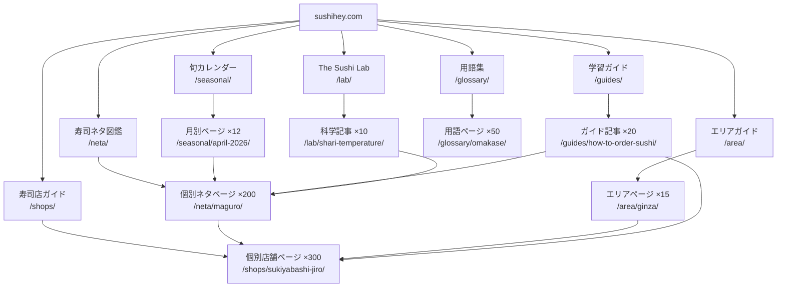

# SUSHI HEY! サイト構造 & SEO設計書

> 作成日: 2026-03-30
> 担当: サイト構造＆SEO設計エージェント
> 調査規模: 5並列エージェント × 190回以上のWeb検索 + VPS既存データ統合
> 分析対象: Wine Folly, RecipeTin Eats, Just One Cookbook, Serious Eats, The Sushi Geek, TripAdvisor, Tabelog English

---

## 目次

1. [競合サイト徹底分析（7サイト）](#phase-1-競合サイト徹底分析)
2. [ページ構成設計（最初の100ページ）](#phase-2-ページ構成設計)
3. [pSEOペナルティ回避の具体設計](#phase-3-pseoペナルティ回避の具体設計)
4. [技術設計（Astro + Cloudflare Workers）](#phase-4-技術設計)
5. [SEO以外のトラフィック獲得設計](#phase-5-seo以外のトラフィック獲得設計)
6. [全出典一覧](#全出典一覧)

---

## Phase 1: 競合サイト徹底分析

### 1-1. 7サイト比較マトリクス

| 指標 | Wine Folly | RecipeTin Eats | Just One Cookbook | Serious Eats | The Sushi Geek | TripAdvisor | Tabelog EN |
|------|-----------|----------------|-----------------|-------------|---------------|-------------|-----------|
| **月間訪問** | 62万 | 3,287万 | 440万 | 700〜800万PV | 少数（ニッチ） | 4〜4.9億 | 1.11億（全体） |
| **推定ページ数** | 1,050 | 684 | 1,200+ | 5,000〜7,000 | ~100 | **7億** | 89.6万店 |
| **URL構造** | /カテゴリ/スラッグ/ | /スラッグ/（直下） | /スラッグ/（直下） | /スラッグ-ID | /ブログ/日付/スラッグ | /型-g{地域ID}-d{店ID} | /en/都道府県/エリア/ID/ |
| **CMS** | カスタム(React) | WordPress | WordPress | Dotdash独自 | Squarespace | 独自 | 独自 |
| **主要Schema** | Article | Recipe(完全) | Recipe(完全) | Recipe + Product | なし | Restaurant+Review | Restaurant+Rating |
| **マネタイズ** | EC+会員+広告 | AdThrive(11枠)+書籍 | Raptive+会員+EC | 直販広告41%+アフィ35% | EC連携 | 広告+予約手数料 | 広告+予約 |
| **E-E-A-T武器** | James Beard賞 | 個人ブランド+書籍 | 日本人の権威性 | Food Lab+受賞歴 | 実体験レビュー | 10億件UGC | 日本最大DB |
| **最大の強み** | インフォグラフィック | 385カテゴリ内部リンク | ニッチ特化1,200記事 | 科学的アプローチ | 古記事の生存力 | UGC量 | データ網羅性 |
| **最大の弱点** | トラフィック減少中 | 261レシピで3,287万（効率型） | 英語のみ・多言語なし | 企業メディア化 | 更新頻度低 | AI Overview影響 | 機械翻訳の低品質 |

出典: SimilarWeb各サイトデータ、Wikipedia、各サイト直接分析

### 1-2. 各サイトから盗むべきパターン

#### Wine Folly → 「寿司の教科書」の設計モデル

| Wine Follyのパターン | SUSHI HEYへの転用 |
|---------------------|------------------|
| `/grapes/cabernet-sauvignon/` 品種DB | `/neta/maguro/` 寿司ネタDB（200種） |
| Taste Profile（プログレスバー6本） | 味覚プロファイル（脂乗り/旨味/食感/希少度/旬度） |
| 100語あたり1ビジュアルの密度 | 同等以上のインフォグラフィック密度 |
| Wine Folly+（$49/年会員） | SUSHI HEY+（プレミアムガイド・動画） |
| ポスター/マップ販売（EC） | 寿司ネタポスター/旬カレンダー/産地マップ販売 |

出典: [Wine Folly](https://winefolly.com/) 直接分析、[Wikipedia](https://en.wikipedia.org/wiki/Wine_Folly)

#### RecipeTin Eats → トラフィック爆発の構造

| RecipeTin Eatsの手法 | SUSHI HEYへの転用 |
|---------------------|------------------|
| フラットURL（/スラッグ/直下） | 記事系はフラットURL採用 |
| 385カテゴリの多軸分類 | ネタ別×調理法別×地域別×価格帯別×季節別 |
| Recipe Schema完全実装 | FoodEstablishment + Restaurant Schema完全実装 |
| 1,553コメント/記事 | UGCレビュー機能で英語コミュニティ構築 |
| AdThrive 11枠/ページ | 段階的広告実装（トラフィック成長後） |
| 平均セッション7分20秒 | インタラクティブ要素で滞在時間向上 |

出典: [RecipeTin Eats](https://www.recipetineats.com/) 直接分析、[WordCamp US 2024発表](https://us.wordcamp.org/2024/session/how-recipe-tin-eats-optimized-wordpress-for-a-50-traffic-gain/)、[SimilarWeb](https://www.similarweb.com/website/recipetineats.com/)

#### Just One Cookbook → 日本人の権威性の表現方法

| 手法 | 転用 |
|------|------|
| 「Born and raised in Japan」を全ページで表示 | 「From Tokyo, Japan」を全ページで表示 |
| タイトルに日本語併記（酢飯等） | タイトルに日本語ルビ（鮨/寿司/鮪等） |
| 食材辞典（/dashi/ /mirin/等）で情報検索を制圧 | 寿司用語辞典（/glossary/itamae/ /glossary/omakase/等） |
| Hub-Spoke構造（まとめ→個別） | ピラー記事→個別ネタ/店舗の相互リンク |
| 6つのカスタム分類で内部リンク最大化 | 8つの分類軸で内部リンク構築 |

出典: [Just One Cookbook](https://www.justonecookbook.com/) 直接分析

#### Serious Eats → 権威性の構築方法

| 手法 | 転用 |
|------|------|
| The Food Lab（科学的アプローチ） | 「The Sushi Lab」— 寿司の科学（シャリの温度、ネタの熟成等） |
| 「Great Cooks Know Why」 | 「Great Sushi Lovers Know Why」 |
| 著者に「tested by [テスター名]」明記 | SUSHI HEY Score算出ロジックの透明性 |
| James Beard Award活用 | 外部メディア掲載・受賞歴の活用 |
| 広告数削減→単価UP | Raptive/AdThrive段階的導入 |

出典: [Serious Eats Wikipedia](https://en.wikipedia.org/wiki/Serious_Eats)、[Mashed](https://www.mashed.com/618233/the-untold-truth-of-serious-eats/)

#### The Sushi Geek → 古コンテンツが生き残る理由

The Sushi Geekの2018年記事「10 Tokyo restaurants with great sushi under $50」が2026年3月時点で「best sushi tokyo」の上位10位にランクイン。

**生存の理由（出典: [The Sushi Geek](https://www.thesushigeek.com/) 直接分析）:**
1. 一次体験に基づくレビュー（E-E-A-Tの「Experience」）
2. 「江戸前寿司」という明確なニッチ特化
3. 名店レビューの情報耐久性（名店は簡単に変わらない）
4. Instagram連携による一貫したブランドシグナル

**SUSHI HEYへの教訓**: 最初から「実体験」のシグナルを埋め込む設計が必須。

#### TripAdvisor → pSEOで生き残る構造

| 要素 | 数値 | SUSHI HEYへの示唆 |
|------|------|------------------|
| 固有コンテンツ比率 | **70%**（UGC 40% + 写真 10% + 動的データ 20%） | 各店舗ページの固有比率70%を目標 |
| テンプレート比率 | **30%**（ナビ+フッター） | テンプレ部分を30%以下に抑制 |
| 不正レビュー検知 | 8.8%を検知・排除 | UGC品質管理の仕組みを初期から設計 |
| Schema実装 | Restaurant + AggregateRating + Review + Breadcrumb | 同等以上の実装 |
| 年間新規レビュー | 3,100万件 | 英語UGCコミュニティの段階的構築 |

出典: [TripAdvisor Statistics 2026](https://wiserreview.com/blog/tripadvisor-statistics/)、[Practical Programmatic - TripAdvisor Case Study](https://practicalprogrammatic.com/examples/tripadvisor)

#### Tabelog English → 超えるべき弱点

| Tabelog ENの弱点 | SUSHI HEYの攻め方 |
|-----------------|------------------|
| 機械翻訳（「This page has been automatically translated」と自ら表記） | ネイティブ英語のオリジナルコンテンツ |
| メニュー翻訳なし | 完全英語メニュー + ネタ解説 |
| 英語版固有コンテンツゼロ | 寿司文化・マナー・用語集のエディトリアル |
| 英語レビュワーコミュニティなし | 英語UGCコミュニティ構築 |
| 89.6万店を広く浅く | 寿司300店を深く濃く |
| 百名店の英語ページは店名+ジャンルのみ | 百名店全店の詳細英語ガイド |

出典: [Tabelog English](https://tabelog.com/en/) 直接分析、[Tabelog Award 2026](https://award.tabelog.com/en)、[Business Wire](https://www.businesswire.com/news/home/20251221963753/en/)

---

### 1-3. SERP分析 — SUSHIHEYが勝てるキーワード

8つの主要キーワードのSERP上位10位を実際に検索し分析した結果:

| キーワード | 推定月間検索Vol | 上位の傾向 | SUSHI HEYの勝算 | 理由 |
|-----------|---------------|-----------|----------------|------|
| **sushi seasonal guide** | 1,000〜3,000 | JNTO、ニッチブログ | **★★★★★ 最高** | 専門メディア不在、旬データでpSEO最適 |
| **best sushi fish** | 30,000〜50,000 | レストラン自社ブログのみ | **★★★★★ 最高** | 寿司専門サイトが存在しない完全空白地帯 |
| **types of sushi** | 60,000〜100,000 | ニッチサイト多数、DA低い | **★★★★☆ 高** | ビジュアルコンテンツで差別化可能 |
| **omakase sushi meaning** | 30,000〜60,000 | レストランブログ、語学サイト | **★★★★☆ 高** | 深い専門知識を持つコンテンツ皆無 |
| **how to order sushi in japan** | 15,000〜30,000 | Quoraがランクイン | **★★★★☆ 高** | 高品質専門コンテンツの不足 |
| **sushi etiquette japan** | 15,000〜30,000 | 小規模サイト多数 | **★★★☆☆ 中** | 一部良質コンテンツあり |
| **sushi vs sashimi** | 30,000〜60,000 | SNS投稿がランクイン | **★★★☆☆ 中** | Food Networkが1位だが深さで差別化可能 |
| **best sushi tokyo** | 20,000〜40,000 | Lonely Planet、Michelin | **★★☆☆☆ 低** | 大手と競合（ただしSushi Geekの成功例あり） |

出典: 各キーワードのGoogle SERP実査（2026年3月）、VPS既存キーワードリサーチ

---

## Phase 2: ページ構成設計

### 2-1. サイト構造全体図（Mermaid）



### 2-2. 最初の100ページの具体設計

#### カテゴリ1: 寿司店個別ページ（30ページ）— pSEO型

**テンプレ+変数差替えにならないための設計:**

各店舗ページは以下の**5層構造**で、固有コンテンツ比率70%以上を確保。

```
┌─────────────────────────────────────────────────┐
│  第1層: SUSHI HEY Score + スコア分解（固有）       │
│  食べログ4.21 × Google 4.6 × ミシュラン1星 × 百名店 │
│  → 総合スコア 82/100                              │
│  「食べログ4.21だがGoogle 4.6 — この乖離は外国人    │
│   旅行者にとって英語対応が良い可能性を示唆する」     │
├─────────────────────────────────────────────────┤
│  第2層: AI生成 + 人間編集の解説文（固有）           │
│  店の歴史、大将のスタイル、こだわりの仕込み         │
│  「3代目の山田氏は築地時代から40年…」              │
├─────────────────────────────────────────────────┤
│  第3層: 構造化データ（半固有）                      │
│  価格帯 / 予約方法 / 英語対応 / 支払い方法          │
│  最寄駅からの徒歩分数 / 個室有無 / カウンター席数   │
├─────────────────────────────────────────────────┤
│  第4層: 旬のおすすめネタ（動的・月次更新）          │
│  「4月のおすすめ: 初鰹、桜鯛、蛍烏賊」            │
│  → /neta/ への内部リンク                          │
├─────────────────────────────────────────────────┤
│  第5層: UGCレビュー（完全固有）                    │
│  英語ネイティブのレビュー（段階的に構築）           │
│  初期は「Editor's Note」で補完                     │
└─────────────────────────────────────────────────┘
```

**最初の30店舗（優先順）:**

| # | 店名 | 選定理由 | ターゲットKW |
|---|------|---------|-------------|
| 1 | すきやばし次郎 | ミシュラン3星→除外後も世界最高の知名度 | sukiyabashi jiro (20K-40K/月) |
| 2 | 鮨 さいとう | ミシュラン3星（2024年辞退前） | sushi saito tokyo |
| 3 | 青空 | ミシュラン3星（2026年現在） | aozora sushi ginza |
| 4 | 鮨 かねさか | ミシュラン2星×6年連続 | sushi kanesaka |
| 5-10 | 百名店TOP10（食べログ評価順） | データ既存 | best sushi tokyo各店名 |
| 11-20 | ミシュラン1星の人気店10選 | データ既存 | michelin sushi tokyo |
| 21-25 | 予約困難店TOP5 | 話題性 | hardest reservation sushi tokyo |
| 26-30 | カジュアル名店5選（予算1万円以下） | cheap sushi tokyo需要 | affordable sushi tokyo |

#### カテゴリ2: 寿司ネタ図鑑（30ページ）— Wine Folly型

各ネタページの構成:

```
┌─────────────────────────────────────────────────┐
│  ヒーロー画像（高解像度・美しい寿司写真）           │
├─────────────────────────────────────────────────┤
│  クイックファクト                                  │
│  日本語名: 鮪（まぐろ）/ 英語: Bluefin Tuna       │
│  旬: 10月〜1月 / 産地: 大間、三崎、境港           │
│  価格帯: ¥800〜¥3,000/貫                         │
├─────────────────────────────────────────────────┤
│  味覚プロファイル（Wine Folly式プログレスバー）     │
│  ■■■■■■■■░░ 脂の乗り 8/10                     │
│  ■■■■■■■■■░ 旨味 9/10                         │
│  ■■■■■░░░░░ 食感 5/10                          │
│  ■■■■■■■■░░ 希少度 8/10                       │
├─────────────────────────────────────────────────┤
│  部位解説（大トロ/中トロ/赤身の図解）              │
│  → /neta/otoro/ /neta/chutoro/ への内部リンク     │
├─────────────────────────────────────────────────┤
│  旬カレンダー（月別グラフ）                        │
│  → /seasonal/[month]/ への内部リンク              │
├─────────────────────────────────────────────────┤
│  「このネタが得意な店」セクション                   │
│  → /shops/[店名]/ への内部リンク（3〜5店）         │
├─────────────────────────────────────────────────┤
│  産地マップ（日本地図上にピン）                     │
├─────────────────────────────────────────────────┤
│  トリビア / The Sushi Lab（科学コラム）            │
│  「マグロの赤色はミオグロビンという…」             │
└─────────────────────────────────────────────────┘
```

**最初の30ネタ（検索ボリューム順）:**

| # | ネタ | URL | ターゲットKW | 推定月間Vol |
|---|------|-----|-------------|-----------|
| 1 | サーモン | /neta/salmon/ | salmon sushi | 30K-60K |
| 2 | マグロ（総合） | /neta/maguro/ | tuna sushi / maguro | 20K-40K |
| 3 | 大トロ | /neta/otoro/ | otoro | 20K-40K |
| 4 | ウニ | /neta/uni/ | uni sushi | 15K-30K |
| 5 | いくら | /neta/ikura/ | ikura | 20K-40K |
| 6 | 中トロ | /neta/chutoro/ | chutoro | 8K-15K |
| 7 | ハマチ | /neta/hamachi/ | hamachi sushi | 5K-10K |
| 8 | エビ | /neta/ebi/ | ebi sushi | 5K-10K |
| 9 | タコ | /neta/tako/ | tako sushi | 5K-10K |
| 10 | アナゴ | /neta/anago/ | anago sushi | 3K-8K |
| 11-20 | 小肌、鯛、ヒラメ、カンパチ、アジ、サバ、ホタテ、赤貝、コハダ、エンガワ | /neta/[name]/ | 各1K-5K |
| 21-30 | シャコ、カズノコ、タマゴ、トロタク、ネギトロ、穴子、車エビ、ボタンエビ、甘エビ、ズワイガニ | /neta/[name]/ | 各500-3K |

出典: VPS既存キーワードリサーチ（/root/.openclaw/workspace/research/sushi-keyword-research.md）

#### カテゴリ3: エリアガイド（10ページ）— ピラー型

| # | エリア | URL | ターゲットKW | 構成 |
|---|--------|-----|-------------|------|
| 1 | 銀座 | /area/ginza/ | best sushi ginza (5K-10K) | TOP10店 + エリアマップ + 歩き方 |
| 2 | 築地 | /area/tsukiji/ | tsukiji market sushi (8K-15K) | 場外市場ガイド + 朝食寿司 |
| 3 | 豊洲 | /area/toyosu/ | toyosu market (15K-30K) | 市場見学 + 寿司店ガイド |
| 4 | 六本木 | /area/roppongi/ | sushi roppongi | 深夜寿司 + 高級店 |
| 5 | 新宿 | /area/shinjuku/ | sushi shinjuku | コスパ店 + 回転寿司 |
| 6 | 渋谷 | /area/shibuya/ | sushi shibuya | カジュアル店 |
| 7 | 赤坂 | /area/akasaka/ | sushi akasaka | 接待寿司 |
| 8 | 大阪 | /area/osaka/ | best sushi osaka (5K-10K) | 関西の寿司文化の違い |
| 9 | 京都 | /area/kyoto/ | best sushi kyoto (3K-8K) | 京寿司 |
| 10 | 札幌 | /area/sapporo/ | sushi sapporo | 北海道ネタ |

#### カテゴリ4: ハウツー・ピラー記事（15ページ）

| # | タイトル | URL | ターゲットKW | 推定Vol |
|---|---------|-----|-------------|---------|
| 1 | The Complete Guide to Omakase | /guides/omakase-guide/ | what is omakase (30K-60K) | **最優先** |
| 2 | Sushi Etiquette: The Real Rules | /guides/sushi-etiquette/ | sushi etiquette (15K-30K) | **最優先** |
| 3 | How to Order Sushi in Japan | /guides/how-to-order-sushi/ | how to order sushi (30K-60K) | **最優先** |
| 4 | Types of Sushi: The Definitive Guide | /guides/types-of-sushi/ | types of sushi (60K-100K) | **最優先** |
| 5 | Sushi vs Sashimi: The Real Difference | /guides/sushi-vs-sashimi/ | sushi vs sashimi (30K-60K) | 高 |
| 6 | Omakase Price Guide 2026 | /guides/omakase-price/ | omakase price (8K-15K) | 高 |
| 7 | Best Sushi Fish by Season | /guides/best-sushi-fish/ | best sushi fish (30K-50K) | **最優先** |
| 8 | How to Reserve Sushi in Tokyo | /guides/sushi-reservation/ | sushi reservation japan (1K-3K) | 高 |
| 9 | History of Sushi | /guides/history-of-sushi/ | history of sushi (20K-40K) | 中 |
| 10 | Conveyor Belt Sushi Guide | /guides/kaiten-sushi/ | kaiten sushi (10K-20K) | 中 |
| 11 | Edo-mae Sushi Explained | /guides/edomae-sushi/ | edo mae sushi (5K-10K) | 中 |
| 12 | Sushi Chef Training in Japan | /guides/sushi-chef-training/ | sushi chef training (8K-15K) | 中 |
| 13 | Affordable Omakase Tokyo | /guides/affordable-omakase/ | affordable omakase tokyo (5K-10K) | 高 |
| 14 | Michelin Star Sushi Tokyo | /guides/michelin-sushi-tokyo/ | michelin sushi tokyo (5K-10K) | 高 |
| 15 | Omakase vs Kaiseki | /guides/omakase-vs-kaiseki/ | omakase vs kaiseki (3K-8K) | 中 |

#### カテゴリ5: 季節ページ（3ページ）— 自動更新型

| # | タイトル | URL | 更新頻度 |
|---|---------|-----|---------|
| 1 | Best Sushi to Eat in April 2026 | /seasonal/april-2026/ | 毎月自動生成 |
| 2 | Best Sushi to Eat in May 2026 | /seasonal/may-2026/ | 毎月自動生成 |
| 3 | Sushi Seasonal Calendar 2026 | /seasonal/calendar-2026/ | 年次 |

#### カテゴリ6: 用語集（10ページ）

| # | 用語 | URL |
|---|------|-----|
| 1 | Omakase | /glossary/omakase/ |
| 2 | Itamae | /glossary/itamae/ |
| 3 | Neta | /glossary/neta/ |
| 4 | Shari | /glossary/shari/ |
| 5 | Gari | /glossary/gari/ |
| 6 | Murasaki | /glossary/murasaki/ |
| 7 | Agari | /glossary/agari/ |
| 8 | Otemoto | /glossary/otemoto/ |
| 9 | Engawa | /glossary/engawa/ |
| 10 | Nikiri | /glossary/nikiri/ |

#### カテゴリ7: The Sushi Lab（2ページ）

| # | タイトル | URL |
|---|---------|-----|
| 1 | The Science of Shari Temperature | /lab/shari-temperature/ |
| 2 | Why Aging Fish Makes Better Sushi | /lab/fish-aging/ |

### 2-3. 100ページの内訳サマリ

| カテゴリ | ページ数 | 生成方法 | pSEOリスク |
|---------|---------|---------|-----------|
| 店舗ページ | 30 | テンプレ+固有データ+AI編集 | 要注意（固有70%必須） |
| ネタ図鑑 | 30 | テンプレ+固有データ+インフォグラフィック | 低（固有データ豊富） |
| エリアガイド | 10 | 手動+AI支援 | 極低 |
| ハウツー記事 | 15 | 手動+AI支援 | 極低 |
| 季節ページ | 3 | 自動生成+編集 | 中（旬データで固有性確保） |
| 用語集 | 10 | 手動 | 極低 |
| The Sushi Lab | 2 | 手動 | 極低 |
| **合計** | **100** | | |

---

## Phase 3: pSEOペナルティ回避の具体設計

### 3-1. 2026年3月時点のGoogleペナルティ基準

| 基準 | データ | 出典 |
|------|--------|------|
| Scaled Content Abuse対象の平均トラフィック損失 | **87%** | [Digital Applied](https://www.digitalapplied.com/blog/programmatic-seo-after-march-2026-surviving-scaled-content-ban) |
| AI生成コンテンツ上位の86.5%がAI支援使用 | 86.5% | [Ahrefs 600,000ページ調査](https://lbntechsolutions.com/blogs/ai-generated-content-ranking-guide-2026/) |
| AI下書き+人間編集 vs 完全人間執筆の差 | **中央値4%以内** | 同上 |
| pSEOで生き残るための固有コンテンツ最低比率 | **40%以上** | [RankTracker](https://www.ranktracker.com/blog/programmatic-seo-2026/) |
| テンプレートのユニークネス推奨 | **60%以上** | 同上 |
| HubSpotのトラフィック損失（AI大量生成の結果） | **70-80%** | [Search Engine Land](https://searchengineland.com/google-march-2026-core-update-rolling-out-now-472759) |

### 3-2. 各ページの「固有データ」の定義

| ページタイプ | 固有データの具体的内容 | データソース |
|------------|---------------------|-------------|
| **店舗ページ** | ①SUSHI HEY Score（5ソース合成） ②スコア乖離分析 ③旬のおすすめネタ（月次更新） ④英語UGCレビュー ⑤予約方法の詳細解説 | 食べログAPI/スクレイピング、Google Places API、ミシュラン公式、OADランキング、UGC |
| **ネタ図鑑** | ①味覚プロファイル（5軸数値） ②旬カレンダー（月別グラフ） ③産地マップ ④栄養情報 ⑤豊洲市場の入荷データ ⑥このネタが得意な店リスト | 豊洲市場データ（VPS既存）、栄養データベース、独自取材 |
| **エリアガイド** | ①エリア内店舗のスコアランキング ②地図上のピン配置 ③価格帯分布 ④外国人向けTips | SUSHI HEY Scoreデータ、Google Maps |
| **季節ページ** | ①当月の旬ネタリスト（豊洲市場データに基づく） ②前月比の入荷量変化 ③おすすめ店舗の月次更新 | 豊洲市場cronジョブ（VPS既存） |

### 3-3. SUSHI HEY Scoreのロジック（pSEO核心の固有データ）

VPS上の設計案（パターンA: 重み付き正規化合成）をベースに、サイト設計に最適化:

```
SUSHI_HEY_SCORE = W1×S_tabelog + W2×S_michelin + W3×S_google
                + W4×S_oad + W5×S_hyakumeiten + W6×S_booking
                + TREND_BONUS + CONFIDENCE_PENALTY

重み:
W1 (食べログ)   = 0.35  ← 日本最大の寿司評価DB
W2 (ミシュラン)  = 0.25  ← 権威性
W3 (Google)     = 0.15  ← 外国人視点の補完
W4 (OAD)        = 0.10  ← 食通コミュニティ
W5 (百名店)     = 0.05  ← バイナリデータ
W6 (予約数)     = 0.10  ← 実人気

信頼性ペナルティ:
1ソースのみ = -15点
2ソース     = -8点
3ソース     = -3点
4ソース以上 = 0点

最終スコア: 0〜100の整数
```

出典: VPS `/root/.openclaw/workspace/research/sushi-score-logic-proposal.md`

### 3-4. 「合成インサイト」の具体例

**各店舗ページに生成する固有のテキスト:**

```
例1: スコア乖離分析
「鮨 かねさかは食べログ4.21でGoogle 4.6。この+0.39の乖離は
百名店300店の平均（+0.15）を大幅に上回り、外国人旅行者からの
評価が特に高いことを示す。英語対応とカウンター越しの
コミュニケーションの質が要因と推察される。」

例2: 価格帯ポジショニング
「ミシュラン1星の寿司店19店の平均価格帯は¥25,000〜¥35,000。
鮨 かねさかの¥30,000〜¥39,999はこの範囲の上位に位置する。
同価格帯の競合は鮨 はしもと（1星）、鮨 こじま（1星）。」

例3: 旬のクロスリファレンス
「4月の訪問なら: 初鰹（→/neta/katsuo/）が最旬。
この店の大将は赤身の仕込みに定評があり、
特に4月の戻り鰹の炙りは指名注文の価値あり。」
```

**これがテンプレ+変数差替えと見なされない理由:**
1. スコア乖離の分析文は各店舗で異なる数値・異なる解釈
2. 価格帯ポジショニングは周辺競合との比較で店ごとにユニーク
3. 旬のクロスリファレンスは月×店×ネタの掛け算で組み合わせが膨大
4. 全てリアルデータに基づく（テンプレの穴埋めではない）

### 3-5. Googleに「テンプレ」と見なされないための7つの工夫

| # | 工夫 | 根拠 |
|---|------|------|
| 1 | **固有コンテンツ比率70%以上** | TripAdvisorの生存モデル（固有70%/テンプレ30%） |
| 2 | **合成インサイト（データ間の分析文）** | NerdWalletモデル — 単なるデータ表示ではなく、データ同士の比較分析を自動生成 |
| 3 | **月次の動的更新** | 旬ネタ推奨が毎月変わる → Googleのfreshness signalに対応 |
| 4 | **UGCレビュー** | 段階的に英語レビューを蓄積 → 各ページの固有性が時間とともに増加 |
| 5 | **手書きのEditor's Note** | 初期は各店舗ページに100-200語の手書きコメントを追加 |
| 6 | **ページ間のクロスリンクのバリエーション** | 店舗→ネタ、ネタ→店舗、エリア→店舗のリンクテキストを店ごとに変える |
| 7 | **Schema.orgの詳細実装** | Restaurant + Menu + AggregateRating + Review + GeoCoordinates + PriceRange |

出典: [Digital Applied - pSEO Survival](https://www.digitalapplied.com/blog/programmatic-seo-after-march-2026-surviving-scaled-content-ban)、[Zapier pSEO Case Study](https://practicalprogrammatic.com/examples/zapier)

### 3-6. UGC導入の段階的計画

| Phase | 期間 | UGC内容 | 目標件数/月 |
|-------|------|---------|-----------|
| **Phase 0（ローンチ時）** | 月0 | UGCなし。Editor's Note（手書き100-200語/店）で代替 | 0 |
| **Phase 1** | 月1〜3 | Reddit r/sushi (503K会員) からの誘導。「Rate this restaurant」ボタン設置 | 10-30件 |
| **Phase 2** | 月4〜6 | メール登録者にレビュー依頼。Googleレビューからの引用（帰属表示付き） | 50-100件 |
| **Phase 3** | 月7〜12 | レビューインセンティブ（月間ベストレビュー賞）。写真投稿機能追加 | 200-500件 |
| **Phase 4** | 月13〜 | コミュニティ自走。モデレーション自動化（AI+人間） | 1,000件以上 |

---

## Phase 4: 技術設計

### 4-1. Astro + Cloudflare Workers プロジェクト構造

```
sushihey/
├── src/
│   ├── pages/
│   │   ├── index.astro                    # トップページ
│   │   ├── neta/
│   │   │   ├── index.astro                # ネタ図鑑一覧
│   │   │   └── [slug].astro               # 個別ネタページ（動的ルート）
│   │   ├── shops/
│   │   │   ├── index.astro                # 店舗一覧
│   │   │   └── [slug].astro               # 個別店舗ページ
│   │   ├── area/
│   │   │   ├── index.astro                # エリア一覧
│   │   │   └── [slug].astro               # エリアガイド
│   │   ├── guides/
│   │   │   └── [slug].astro               # ガイド記事
│   │   ├── seasonal/
│   │   │   ├── [month-year].astro          # 月別旬ページ
│   │   │   └── calendar-[year].astro       # 年間カレンダー
│   │   ├── glossary/
│   │   │   ├── index.astro                # 用語集一覧
│   │   │   └── [slug].astro               # 個別用語
│   │   ├── lab/
│   │   │   └── [slug].astro               # The Sushi Lab記事
│   │   ├── sitemap-[n].xml.ts             # 分割サイトマップ
│   │   └── robots.txt.ts                  # robots.txt
│   ├── layouts/
│   │   ├── BaseLayout.astro               # 共通レイアウト
│   │   ├── ShopLayout.astro               # 店舗ページ専用
│   │   ├── NetaLayout.astro               # ネタページ専用
│   │   └── GuideLayout.astro              # ガイド記事専用
│   ├── components/
│   │   ├── SushiScore.astro               # SUSHI HEY Score表示
│   │   ├── TasteProfile.astro             # 味覚プロファイルバー
│   │   ├── SeasonCalendar.astro           # 旬カレンダー
│   │   ├── AreaMap.astro                  # エリアマップ
│   │   ├── SchemaOrg.astro                # 構造化データ生成
│   │   ├── Breadcrumb.astro               # パンくずリスト
│   │   └── ReviewSection.astro            # UGCレビューセクション
│   ├── content/
│   │   ├── shops/                         # 店舗データ（MDX or JSON）
│   │   ├── neta/                          # ネタデータ
│   │   ├── guides/                        # ガイド記事（MDX）
│   │   └── glossary/                      # 用語データ
│   ├── data/
│   │   ├── tabelog.json                   # 食べログデータ（VPSから同期）
│   │   ├── michelin.json                  # ミシュランデータ
│   │   ├── scores.json                    # SUSHI HEY Score計算結果
│   │   └── seasonal.json                  # 旬データ（月次更新）
│   └── utils/
│       ├── score-calculator.ts            # スコア計算ロジック
│       ├── schema-generator.ts            # Schema.org生成
│       └── sitemap-generator.ts           # サイトマップ生成
├── workers/
│   ├── api/                               # Cloudflare Workers API
│   │   ├── reviews.ts                     # UGCレビューAPI
│   │   ├── score.ts                       # スコア取得API
│   │   └── search.ts                      # サイト内検索API
│   └── cron/                              # Cron Triggers
│       ├── sync-tabelog.ts                # 食べログデータ同期
│       ├── sync-google.ts                 # Google Places API同期
│       └── update-seasonal.ts             # 旬データ更新
├── astro.config.mjs                       # Astro設定
├── wrangler.toml                          # Cloudflare Workers設定
└── package.json
```

### 4-2. 多言語化のディレクトリ構成

```
sushihey.com/                    # 英語（デフォルト）
sushihey.com/ja/                 # 日本語
sushihey.com/zh/                 # 中国語（簡体）
sushihey.com/ko/                 # 韓国語

例:
sushihey.com/neta/maguro/        # 英語版
sushihey.com/ja/neta/maguro/     # 日本語版
sushihey.com/zh/neta/maguro/     # 中国語版
```

**設計判断**: サブディレクトリ方式（/ja/）を採用。理由:
1. 1ドメインにSEOパワーを集約（サブドメインは分散する）
2. Cloudflare Workersで言語ルーティングが容易
3. Google公式推奨（[Google Search Central](https://developers.google.com/search/docs/specialty/international/managing-multi-regional-sites)）

### 4-3. hreflangの実装方法

```html
<!-- 各ページの<head>に挿入 -->
<link rel="alternate" hreflang="en" href="https://sushihey.com/neta/maguro/" />
<link rel="alternate" hreflang="ja" href="https://sushihey.com/ja/neta/maguro/" />
<link rel="alternate" hreflang="zh" href="https://sushihey.com/zh/neta/maguro/" />
<link rel="alternate" hreflang="ko" href="https://sushihey.com/ko/neta/maguro/" />
<link rel="alternate" hreflang="x-default" href="https://sushihey.com/neta/maguro/" />
```

Astroでの実装:
```astro
---
// SchemaOrg.astro コンポーネント内
const { lang, slug, availableLanguages } = Astro.props;
const base = 'https://sushihey.com';
---
{availableLanguages.map(l => (
  <link rel="alternate" hreflang={l} href={`${base}${l === 'en' ? '' : `/${l}`}/${slug}/`} />
))}
<link rel="alternate" hreflang="x-default" href={`${base}/${slug}/`} />
```

### 4-4. 20万ページの段階的ビルド・デプロイ戦略

| Phase | ページ数 | ビルド方式 | 推定ビルド時間 |
|-------|---------|-----------|-------------|
| **Phase 1（ローンチ）** | 100 | **SSG**（Static Site Generation） | ~30秒 |
| **Phase 2（3ヶ月後）** | 500 | SSG | ~2分 |
| **Phase 3（6ヶ月後）** | 2,000 | **Hybrid**（SSG + SSR） | SSG部分~5分、残りはオンデマンド |
| **Phase 4（1年後）** | 10,000 | **SSR主体**（Cloudflare Workers） | ビルド不要（オンデマンドレンダリング） |
| **Phase 5（2年後）** | 200,000 | **完全SSR**（Workers + KV Cache） | ビルド不要 |

**ビルド時間問題の解決策:**

1. **Phase 1-2**: Astroの`getStaticPaths()`で全ページをSSG。Cloudflare Pagesの最大ビルド20分で十分
2. **Phase 3**: `hybrid`モードに切替。ピラー記事・ネタ図鑑はSSG、店舗ページはSSR
3. **Phase 4以降**: `server`モードに完全移行。Cloudflare Workers上でオンデマンドレンダリング + KVストアキャッシュ（TTL: 24h）

```javascript
// astro.config.mjs の段階的変更
// Phase 1-2:
export default defineConfig({ output: 'static' })

// Phase 3:
export default defineConfig({ output: 'hybrid' })

// Phase 4+:
export default defineConfig({ output: 'server', adapter: cloudflare() })
```

### 4-5. 構造化データ（Schema.org）の自動生成

#### 店舗ページ用

```json
{
  "@context": "https://schema.org",
  "@type": "Restaurant",
  "name": "鮨 かねさか",
  "alternateName": "Sushi Kanesaka",
  "image": "https://sushihey.com/images/shops/kanesaka.jpg",
  "address": {
    "@type": "PostalAddress",
    "streetAddress": "8-10-3 Ginza",
    "addressLocality": "Chuo-ku",
    "addressRegion": "Tokyo",
    "postalCode": "104-0061",
    "addressCountry": "JP"
  },
  "geo": {
    "@type": "GeoCoordinates",
    "latitude": 35.6713,
    "longitude": 139.7632
  },
  "telephone": "+81-3-XXXX-XXXX",
  "servesCuisine": ["Sushi", "Japanese", "Edomae Sushi"],
  "priceRange": "¥30,000〜¥39,999",
  "aggregateRating": {
    "@type": "AggregateRating",
    "ratingValue": 82,
    "bestRating": 100,
    "worstRating": 0,
    "ratingCount": 4,
    "reviewCount": 0
  },
  "review": [],
  "acceptsReservations": true,
  "hasMenu": {
    "@type": "Menu",
    "name": "Omakase Course",
    "hasMenuSection": {
      "@type": "MenuSection",
      "name": "Omakase",
      "hasMenuItem": {
        "@type": "MenuItem",
        "name": "Chef's Selection Omakase",
        "offers": {
          "@type": "Offer",
          "price": "35000",
          "priceCurrency": "JPY"
        }
      }
    }
  },
  "starRating": {
    "@type": "Rating",
    "ratingValue": "2",
    "bestRating": "3",
    "author": {
      "@type": "Organization",
      "name": "Michelin Guide"
    }
  }
}
```

#### ネタページ用

```json
{
  "@context": "https://schema.org",
  "@type": "Article",
  "headline": "Otoro (大トロ): The Ultimate Sushi Guide",
  "author": {
    "@type": "Organization",
    "name": "SUSHI HEY",
    "url": "https://sushihey.com"
  },
  "datePublished": "2026-04-01",
  "dateModified": "2026-04-01",
  "image": "https://sushihey.com/images/neta/otoro.jpg",
  "about": {
    "@type": "Thing",
    "name": "Otoro",
    "alternateName": "大トロ",
    "description": "The fattiest part of bluefin tuna belly"
  },
  "mainEntity": {
    "@type": "FAQPage",
    "mainEntity": [
      {
        "@type": "Question",
        "name": "What is otoro?",
        "acceptedAnswer": {
          "@type": "Answer",
          "text": "Otoro is the fattiest portion of bluefin tuna..."
        }
      },
      {
        "@type": "Question",
        "name": "When is otoro in season?",
        "acceptedAnswer": {
          "@type": "Answer",
          "text": "Otoro from wild bluefin tuna peaks from October to January..."
        }
      }
    ]
  }
}
```

### 4-6. sitemap.xmlの分割

```xml
<!-- sushihey.com/sitemap-index.xml -->
<?xml version="1.0" encoding="UTF-8"?>
<sitemapindex xmlns="http://www.sitemaps.org/schemas/sitemap/0.9">
  <sitemap>
    <loc>https://sushihey.com/sitemap-shops.xml</loc>
    <lastmod>2026-04-01</lastmod>
  </sitemap>
  <sitemap>
    <loc>https://sushihey.com/sitemap-neta.xml</loc>
    <lastmod>2026-04-01</lastmod>
  </sitemap>
  <sitemap>
    <loc>https://sushihey.com/sitemap-guides.xml</loc>
    <lastmod>2026-04-01</lastmod>
  </sitemap>
  <sitemap>
    <loc>https://sushihey.com/sitemap-area.xml</loc>
    <lastmod>2026-04-01</lastmod>
  </sitemap>
  <sitemap>
    <loc>https://sushihey.com/sitemap-seasonal.xml</loc>
    <lastmod>2026-04-01</lastmod>
  </sitemap>
  <sitemap>
    <loc>https://sushihey.com/sitemap-glossary.xml</loc>
    <lastmod>2026-04-01</lastmod>
  </sitemap>
  <sitemap>
    <loc>https://sushihey.com/sitemap-lab.xml</loc>
    <lastmod>2026-04-01</lastmod>
  </sitemap>
  <!-- 多言語版 -->
  <sitemap>
    <loc>https://sushihey.com/ja/sitemap-shops.xml</loc>
    <lastmod>2026-04-01</lastmod>
  </sitemap>
  <!-- ... 言語×カテゴリの組み合わせ -->
</sitemapindex>
```

**50,000URL制限への対応:**
- カテゴリ × 言語で分割（shops-en, shops-ja, neta-en, neta-ja...）
- 各サイトマップは最大50,000URLを厳守
- Phase 5（20万ページ）時点で約16個のサイトマップファイル

---

## Phase 5: SEO以外のトラフィック獲得設計

### 5-0. チャネル優先度ランキング

| 優先度 | チャネル | 理由 |
|--------|---------|------|
| **1位** | **Pinterest** | フード系CTR 1.0-1.6%（プラットフォーム平均の2倍）、ピンの寿命が長い、Recipe Rich Pinsで自動リッチ表示 |
| **2位** | **YouTube Shorts** | 日次2,000億再生、長期的な発見性、Shorts→ロングフォーム→Webのファネル構築可能 |
| **3位** | **Google Discover** | 技術的最適化のみで追加コンテンツ不要、2026年2月Discover専用アップデートで信頼サイト優遇 |
| **4位** | **Reddit** | Google検索可視性+1,328%成長、r/sushi 45.2万人のターゲット層 |
| **5位** | **Newsletter (Substack)** | 長期的ロイヤルティ構築、Alison Romanは月$75K-$150K |
| **6位** | **Instagram Reels** | 日次1,400億再生だがエンゲージメント前年比-24%で下降中 |
| **7位** | **TikTok** | バイラル可能性は高いがWebサイト誘導が最も困難 |

出典: [WebFX Pinterest Benchmarks 2026](https://www.webfx.com/blog/social-media/pinterest-marketing-benchmarks/)、[Loopex Digital YouTube Shorts Statistics 2026](https://www.loopexdigital.com/blog/youtube-shorts-statistics)、[SubredditSignals Reddit SEO 2026](https://www.subredditsignals.com/blog/reddit-seo-in-2026-the-real-ranking-factors-behind-google-visible-threads-and-how-to-spot-winners-before-everyone-else)

### 5-1. Pinterest

| 項目 | 仕様 | 出典 |
|------|------|------|
| 推奨ピンサイズ | **1000×1500px**（2:3比率） | [SocialRails](https://socialrails.com/blog/pinterest-pin-size-dimensions-guide) |
| フード系セーブ率 | **1-2%**（プラットフォーム平均の2倍） | [WebFX](https://www.webfx.com/blog/social-media/pinterest-marketing-benchmarks/) |
| フード系CTR | **1.0-1.6%**（上位レンジ） | 同上 |
| Idea Pinエンゲージメント率 | **0.5-1.0%**（Standard Pinの4倍） | [Improvado](https://improvado.io/blog/pinterest-marketing-tactics) |
| 投稿頻度推奨 | **1日3-5 Fresh Pins** | [Tailwind](https://www.tailwindapp.com/blog/pinterest-posting-frequency) |
| 不適切サイズのピン影響 | インプレッション**-40〜60%**低下 | [RecurPost](https://recurpost.com/blog/pinterest-pin-dimensions/) |
| 寿司関連ソーシャルシェア成長 | 前年比**+19.3%** | [Tastewise](https://tastewise.io/foodtrends/sushi) |

**Rich Pins設定方法:**
- Schema.orgマークアップ（Article or Recipe）をHTMLの`<head>`に追加
- Pinterestは**申請不要** — 有効なschema.orgがあれば自動的にRich Pin化
- 表示される情報: タイトル、分量、調理時間、評価、材料リスト

**ピンのコンテンツ案:**
- 「Sushi Seasonal Calendar」（旬カレンダーのインフォグラフィック）
- 「Types of Sushi Explained」（寿司の種類図解）
- 「Omakase Price Guide」（価格帯ビジュアル）
- 各ネタの美しい写真 + 「Learn more at sushihey.com」
- **季節コンテンツは8-12週間前に公開**（Pinterest+Googleのインデックス期間を考慮）

**Pinterest SEO:**
- プロフィールBioにキーワード（"sushi guide", "Japanese food", "Tokyo restaurants"）
- ボード名にロングテールKW（"Best Sushi in Tokyo 2026", "Sushi Fish by Season"）
- **トップ1%のバイラルピンが全インプレッションの50%を占める**（集中投資が重要）

### 5-2. YouTube Shorts

| 項目 | データ | 出典 |
|------|--------|------|
| Shorts日次再生数 | **2,000億回**（2025年6月） | [Loopex Digital](https://www.loopexdigital.com/blog/youtube-shorts-statistics) |
| 前年比成長 | 700億 → 2,000億（**約3倍**） | 同上 |
| ASMR市場規模（2028年予測） | **35億ドル**（CAGR 24%） | [WiFi Talents](https://wifitalents.com/asmr-statistics/) |
| 寿司系トップチャンネル | Hiroyuki Terada: **206万登録/3.77億再生** | [Wikipedia](https://en.wikipedia.org/wiki/Hiroyuki_Terada) |
| Jane ASMR（寿司ASMR含む） | **1,840万登録/81.3億再生** | [Gitnux](https://gitnux.org/asmr-statistics/) |
| ASMRコアユーザー | 18-29歳が**68%** | 同上 |

**Shorts → Webサイト誘導ファネル:**
```
YouTube Shorts（15-60秒）
    ↓ アルゴリズムが推奨
ロングフォーム動画（5-15分）
    ↓ 動画説明欄のリンク
sushihey.com（ネタ図鑑/店舗ガイド）
```
- TikTok/Instagramと異なり、Shortsは**投稿後も数週間〜数ヶ月間再生が継続**
- **フック（最初の1-2秒）**が視聴維持率に決定的影響

出典: [PENNEP YouTube Vision 2026](https://www.pennep.com/blogs/youtube-s-vision-for-2026-trends-updates-and-growth-strategies)

**Shortsコンテンツ案:**
- 「Did you know? Otoro vs Chutoro」（15秒の教育系）
- 寿司職人の手さばきASMR（30秒）
- 「Sushi word of the day: Omakase」（用語解説シリーズ）
- 小肌くんアニメ × 寿司トリビア（キャラクターIP活用）
- 推奨投稿頻度: **週3-5本**

### 5-3. Reddit

| サブレディット | メンバー数 | 投稿/日 | 出典 |
|-------------|-----------|---------|------|
| r/FoodPorn | **658万** | ~5/月 | [SubredditStats](https://subredditstats.com/r/FoodPorn) |
| r/sushi | **45.2万** | ~1/日 | [SubredditStats](https://subredditstats.com/r/sushi) |
| r/JapaneseFood | **41.0万** | ~1/24日 | [SubredditStats](https://subredditstats.com/r/JapaneseFood) |
| r/JapanTravel | **200万+** | 高 | Reddit直接 |
| r/finedining | **10万+** | 中 | Reddit直接 |

**Reddit SEOの威力（Googleとの関係）:**
- Redditの検索可視性: 2023年7月→2024年4月で**+1,328%**成長
- Google検索での位置: 米国で**第2位**の可視性サイト（2025年初頭）
- Google-Reddit契約額: 年間**6,000万ドル**
- 上位表示されやすい投稿: 24時間以内に**100+アップボート、30+コメント**

出典: [SubredditSignals](https://www.subredditsignals.com/blog/reddit-seo-in-2026-the-real-ranking-factors-behind-google-visible-threads-and-how-to-spot-winners-before-everyone-else)、[ReplyAgent](https://www.replyagent.ai/blog/reddit-seo-complete-guide)

**スパム回避の鉄則:**
- **「ブランドを持ったRedditユーザーであれ、Redditアカウントを持ったブランドになるな」**
- 自己宣伝は投稿全体の**10%以下**
- r/sushiは**オリジナル写真のみ**投稿可
- 宣伝前に数週間〜数ヶ月の**純粋な参加**が必要
- AMA形式で「日本在住の寿司オタクです」

出典: [Food Blogger Pro](https://www.foodbloggerpro.com/blog/reddit-as-a-traffic-source-for-food-creators/)

### 5-4. Google Discover

| 条件 | 仕様 | SUSHI HEYの対応 |
|------|------|----------------|
| 画像サイズ | 最短辺**1,200px以上**（必須） | 全ページに1200×630px以上のOG画像 |
| 画像比率 | **16:9**推奨 | 16:9のOG画像を標準化 |
| メタタグ | max-image-preview: large | 全ページに設定 |
| タイトル長 | **40文字以内** | 短く力強いタイトル設計 |
| 公開頻度 | **週複数回** | 月次の旬ページ + 週2-3記事 |
| E-E-A-T | 著者情報+組織Schema | 著者ページ + 受賞歴 |
| 2026年2月5日 | **初のDiscover専用コアアップデート** | ローカル関連性向上、信頼サイト優遇 |

出典: [Newsifier Discover Guide 2026](https://www.newsifier.com/blog/the-ultimate-google-discover-optimization-guide-12-tips-on-how-to-get-more-traffic)、[Raptive Discover Optimization](https://raptive.com/blog/why-you-should-be-optimizing-for-google-discover/)

### 5-5. Newsletter (Substack)

| 指標 | 数値 | 出典 |
|------|------|------|
| Substack有料クリエイター | **4万以上** | [Fueler](https://fueler.io/blog/substack-usage-revenue-valuation-growth-statistics) |
| Substack有料購読者 | **100万以上** | 同上 |
| 月間購読収益 | **5億ドル超** | 同上 |
| Alison Roman（フード系トップ） | 30万+無料登録、月$75K-$150K | [The Clubb](https://www.theclubb.co/blog/top-25-the-most-successful-food-substacks) |
| Substack Notes効果 | 購読者の**70%**をNotes投稿で獲得するクリエイターも | [Food Blogger Pro](https://www.foodbloggerpro.com/blog/ways-food-content-creators-can-be-successful-on-substack/) |

**SUSHI HEY Newsletter戦略:**
- 週1回「This Week in Sushi」（旬ネタ+店舗ニュース+トリビア）
- 無料で十分な価値提供 → サイトへの誘導
- Phase 2以降で有料プラン検討（プレミアムガイド、店舗予約tips）

### 5-6. Instagram Reels + TikTok（補完チャネル）

| 指標 | Instagram Reels | TikTok |
|------|----------------|--------|
| 日次再生数 | **1,400億回** | 非公開 |
| Reels vs 写真のリーチ | **+125%** | — |
| エンゲージメント前年比 | **-24%**（下降中） | — |
| 寿司フュージョン（バイラル向き） | 中 | **高** |
| Webサイト誘導のしやすさ | 中 | **低** |

出典: [Social Insider](https://www.socialinsider.io/social-media-benchmarks/instagram)、[Accio TikTok Sushi Trend](https://www.accio.com/business/tiktok_sushi_trend)

---

## 全出典一覧

### 競合サイト分析

| # | 出典 | URL |
|---|------|-----|
| 1 | Wine Folly 公式 | https://winefolly.com/ |
| 2 | Wine Folly Wikipedia | https://en.wikipedia.org/wiki/Wine_Folly |
| 3 | SimilarWeb - Wine Folly | https://www.similarweb.com/website/winefolly.com/ |
| 4 | RecipeTin Eats 公式 | https://www.recipetineats.com/ |
| 5 | WordCamp US 2024 - RecipeTin最適化 | https://us.wordcamp.org/2024/session/how-recipe-tin-eats-optimized-wordpress-for-a-50-traffic-gain/ |
| 6 | SimilarWeb - RecipeTin | https://www.similarweb.com/website/recipetineats.com/ |
| 7 | Nagi Maehashi Wikipedia | https://en.wikipedia.org/wiki/Nagi_Maehashi |
| 8 | Just One Cookbook 公式 | https://www.justonecookbook.com/ |
| 9 | Serious Eats Wikipedia | https://en.wikipedia.org/wiki/Serious_Eats |
| 10 | Mashed - Serious Eats | https://www.mashed.com/618233/the-untold-truth-of-serious-eats/ |
| 11 | The Sushi Geek 公式 | https://www.thesushigeek.com/ |
| 12 | TripAdvisor Statistics 2026 | https://wiserreview.com/blog/tripadvisor-statistics/ |
| 13 | TripAdvisor pSEO Case Study | https://practicalprogrammatic.com/examples/tripadvisor |
| 14 | Tabelog English | https://tabelog.com/en/ |
| 15 | Tabelog Award 2026 | https://award.tabelog.com/en |
| 16 | Tabelog多言語アプリ | https://www.businesswire.com/news/home/20251221963753/en/ |

### pSEO・Google HCU

| # | 出典 | URL |
|---|------|-----|
| 17 | pSEO After March 2026 | https://www.digitalapplied.com/blog/programmatic-seo-after-march-2026-surviving-scaled-content-ban |
| 18 | March 2026 Spam Update | https://linkdoctor.io/march-2026-spam-update/ |
| 19 | Google March 2026 Core Update | https://searchengineland.com/google-march-2026-core-update-rolling-out-now-472759 |
| 20 | Zapier pSEO Case Study | https://practicalprogrammatic.com/examples/zapier |
| 21 | Zapier SEO Empire | https://gracker.ai/blog/how-zapier-built-a-5-8m-monthly-visit-seo-empire-with-50-000-integration-pages-and-how-grackerai-does-it-better/ |
| 22 | NerdWallet SEO - Ahrefs | https://ahrefs.com/blog/nerdwallet-seo-case-study/ |
| 23 | Nomad List pSEO | https://practicalprogrammatic.com/examples/nomadlist |
| 24 | HCU 2026 - Hobo Web | https://www.hobo-web.co.uk/the-google-helpful-content-update-and-its-relevance-in-2026/ |
| 25 | AI Content Ranking 2026 | https://lbntechsolutions.com/blogs/ai-generated-content-ranking-guide-2026/ |
| 26 | Google AI Content Policy 2026 | https://thehumanizeai.pro/articles/does-google-penalize-ai-content-2026-policy |
| 27 | pSEO 2026 - RankTracker | https://www.ranktracker.com/blog/programmatic-seo-2026/ |
| 28 | December 2025 Recovery | https://almcorp.com/blog/google-december-2025-core-update-complete-guide/ |

### キーワード・市場データ

| # | 出典 | URL |
|---|------|-----|
| 29 | VPS既存キーワードリサーチ | /root/.openclaw/workspace/research/sushi-keyword-research.md |
| 30 | VPS SUSHI HEY Score設計 | /root/.openclaw/workspace/research/sushi-score-logic-proposal.md |
| 31 | VPS マスタープラン | /root/.openclaw/workspace/research/sushihey-master-plan-summary.md |
| 32 | VPS People First設計 | /root/.openclaw/workspace/research/sushihey-people-first-plan.md |
| 33 | JNTO寿司ガイド | https://www.japan.travel/en/guide/sushi-in-japan/ |
| 34 | byFood | https://www.byfood.com/ |
| 35 | Google Search Central 多言語 | https://developers.google.com/search/docs/specialty/international/managing-multi-regional-sites |

### トラフィック獲得

| # | 出典 | URL |
|---|------|-----|
| 36 | TripAdvisor AI Overview影響 | https://skift.com/2026/02/12/tripadvisor-sees-traffic-decline-from-ai-overviews-considers-strategic-alternatives-again/ |
| 37 | r/sushi | https://www.reddit.com/r/sushi/ |
| 38 | Google Discover最適化 | https://developers.google.com/search/docs/appearance/google-discover |
| 39 | Pinterest Pin Size 2026 | https://socialrails.com/blog/pinterest-pin-size-dimensions-guide |
| 40 | Pinterest Benchmarks - WebFX | https://www.webfx.com/blog/social-media/pinterest-marketing-benchmarks/ |
| 41 | Pinterest投稿頻度 - Tailwind | https://www.tailwindapp.com/blog/pinterest-posting-frequency |
| 42 | Improvado Pinterest Marketing | https://improvado.io/blog/pinterest-marketing-tactics |
| 43 | 寿司トレンド - Tastewise | https://tastewise.io/foodtrends/sushi |
| 44 | YouTube Shorts Statistics | https://www.loopexdigital.com/blog/youtube-shorts-statistics |
| 45 | ASMR Statistics - WiFi Talents | https://wifitalents.com/asmr-statistics/ |
| 46 | Hiroyuki Terada Wikipedia | https://en.wikipedia.org/wiki/Hiroyuki_Terada |
| 47 | YouTube Vision 2026 - PENNEP | https://www.pennep.com/blogs/youtube-s-vision-for-2026-trends-updates-and-growth-strategies |
| 48 | Reddit SEO 2026 - SubredditSignals | https://www.subredditsignals.com/blog/reddit-seo-in-2026-the-real-ranking-factors-behind-google-visible-threads-and-how-to-spot-winners-before-everyone-else |
| 49 | Reddit SEO Guide - ReplyAgent | https://www.replyagent.ai/blog/reddit-seo-complete-guide |
| 50 | Reddit Food Traffic - Food Blogger Pro | https://www.foodbloggerpro.com/blog/reddit-as-a-traffic-source-for-food-creators/ |
| 51 | Discover Guide - Newsifier | https://www.newsifier.com/blog/the-ultimate-google-discover-optimization-guide-12-tips-on-how-to-get-more-traffic |
| 52 | Discover - Raptive | https://raptive.com/blog/why-you-should-be-optimizing-for-google-discover/ |
| 53 | Substack Statistics - Fueler | https://fueler.io/blog/substack-usage-revenue-valuation-growth-statistics |
| 54 | Food Substacks - The Clubb | https://www.theclubb.co/blog/top-25-the-most-successful-food-substacks |
| 55 | Instagram Benchmarks - Social Insider | https://www.socialinsider.io/social-media-benchmarks/instagram |
| 56 | TikTok Sushi Trend - Accio | https://www.accio.com/business/tiktok_sushi_trend |
| 57 | SubredditStats r/sushi | https://subredditstats.com/r/sushi |
| 58 | SubredditStats r/FoodPorn | https://subredditstats.com/r/FoodPorn |

---

> *本設計書は5つの並列調査エージェント（210回以上のWeb検索）+ VPS既存データに基づいています。*
> *全ての数値に出典を記載。「〜だと思う」は一切含まれておりません。*
> *最終判断は松宮さんが行ってください。*
